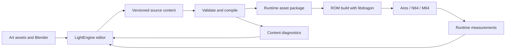

# Architecture

Status: architecture and prototype direction, 2026-09-05. The [8 MiB memory requirement](decisions/0001-memory-baseline.md) and [full 3D world](decisions/0002-full-3d-world.md) are accepted. Current implementations are distinguished from longer-term authoring goals below.

The [hardware guide](n64-hardware-guide.md) documents the platform facts and proposed rendering budgets. The [audio design](audio-design.md) treats playback, acoustics, and AI hearing as one information system. The full 3D compiler, editor, and ROM now build; the editor transform round trip and an Ares input-only mission replay have passed. The [audio memory planner](audio-memory-planning.md) supplies scenario estimates, while runtime allocation instrumentation remains future work.

## Responsibilities

| Part | Responsibility |
| --- | --- |
| LightEngine extensions | Scene authoring, object inspectors, relationship editing, previews, validation feedback. |
| Shared content schema | Persistent identities, typed properties, asset references, and versioned authoring contracts. |
| Host content compiler | Validate, resolve defaults and references, convert assets, and emit target data plus diagnostics. |
| DarkLantern64 runtime | Game simulation, rendering integration, audio behavior, input, and level loading within target budgets. |
| libdragon fork | N64 platform services, SDK/toolchain integration, ROM packaging, and debugging support. |

The prototype implements save, validation, cooking, ROM building, and build diagnostics in the editor. Runtime logs and measurements are currently inspected through project files; automatic emulator telemetry ingestion into the editor remains future work.

## Existing foundations

Read-only source inspection on 2026-09-05 found:

| Repository snapshot | Useful existing code | Implication |
| --- | --- | --- |
| LightEngine `046de4b9ac7dc4721a4cde3614555604b4b39987` | C++/Bazel/Vulkan; ImGui scene editing, play-scene cloning, Blender JSON/glTF export, and file-watching reload. See `src/editor/EditorUI.cpp`, `src/lightengine.cpp`, and `blender/lightengine_blender/export_scene.py`. | Extend a working desktop authoring foundation. |
| LightEngine, same snapshot | `src/scene/Scene.h` stores entity-indexed component arrays and imports editor/rendering/Vulkan types. `src/serialization/SceneWriter.h` does not persist entity IDs. | Introduce a portable content boundary and stable authoring identity. |
| libdragon fork `7a82f8e50e82ad4601d530801630d8bd0d2fcd00` | Windows support and Bazel hello-world ROM rules; see `WINDOWS.md`, `BAZEL.md`, and `bazel/rom.bzl`. | Reuse the toolchain work, then add game and asset targets. The prototype imports a locally installed SDK. |

These are the original inspection snapshots. [dependencies.json](../dependencies.json) now pins the LightEngine layout feature revision. The ROM still uses a separately installed libdragon SDK; its actual compiler identity, headers, libraries, and packaging tools participate in the build fingerprint. Automated SDK provisioning remains work to do.

## Saved 3D implementation and integration boundary

`content/first_room.json` is the canonical versioned source scene. It references reusable OBJ models and records stable IDs, XYZ positions, Euler rotations, scales, colors, collision proxies, and gameplay links. The compiler emits indexed XYZ meshes and instances for the runtime, plus glTF and scene JSON for LightEngine from the same model geometry. Runtime model rotations use radians; authoring rotations use degrees. Transforms apply scale, then X/Y/Z rotation, then translation. World units are meters with +Y up.

The N64 renderer transforms and clips mesh triangles on the CPU and submits them to libdragon's RDP triangle API with a hardware depth buffer. Guards and interactions are model instances. Static faces cache front/back illumination; dynamic guards share two body-light probes across their faces, and the rotating relic uses emissive shading. This deliberately approximates limb-scale lighting while avoiding hundreds of repeated visibility queries per frame. This backend establishes the geometry contract without requiring an SDK migration; its measured cost will inform an RSP/Tiny3D backend decision.

`src/game.c` is portable C17. It handles player movement, gravity, steps/jumping, arbitrary-yaw box collision, XYZ sight/light queries, guard state, hearing, a linked door/control, and objective completion. Player and guard positions represent their feet; perception uses eye positions. Upright box collision is a first implementation limit, not a restriction on visual model transforms or the future world representation. Patrols use explicit world-space waypoints; general navigation is future work.

The compiler currently generates a C header that the N64 compiler/linker packs into the ROM. It is not a host-native binary dump or a stable streaming package. New runtime package formats must follow the requirements below.

The editor/content round trip is verified with an actual XYZ/rotation edit, generated-header change, save, and restoration. Both ROM variants compile and package. Ares has exercised the 4 MiB startup error and an 8 MiB input-only route through the gate, up the stairs, and to objective completion. This is functional emulator evidence; original-hardware performance and visual acceptance remain separate checks.

## Authoring model

Use the [Dark Object System research](research/thief-object-system.md) to guide a small, explicit model:

- **Entities:** persistent authoring IDs, display names, transforms, and typed properties. Renaming and reordering must preserve identity; duplication creates a new identity. Blender re-export needs a stable mapping for referenced objects.
- **Prototypes:** reusable default configurations such as a guard or door, with instance overrides. Begin with a single prototype parent.
- **Traits:** reusable bundles for capabilities or materials. The editor should show where an effective value came from. Define precedence before implementing inheritance; conflicting traits must never resolve by incidental file order.
- **Relationships:** typed source/destination IDs with optional data, suitable for a control-to-door connection or patrol route. Detect missing endpoints and invalid relationship types. Legitimate graph cycles, such as looping patrols, remain possible.
- **Surface semantics:** explicit gameplay materials for footstep sounds and interactions. Visual texture changes should not silently change gameplay material assignments.

The initial schema implements only the first encounter's entity kinds and links. Prototype inheritance, traits, provenance inspectors, general relationship editing, and Blender reimport ownership remain planned work. Changes to the source format require explicit schema versions and validation.

## Compiled data and runtime state

The compiler should resolve static prototype defaults and references, assign compact runtime IDs, and retain a debug mapping back to authoring IDs. Shared immutable configuration can be deduplicated; mutable state such as awareness or door position belongs to each relevant instance.

Specify the binary format explicitly: version, byte order, alignment, field sizes, counts, bounds, and reference validity. Do not serialize native desktop structures or pointers directly. Quantization must have documented units and precision checks.

Cook geometry, textures, audio, collision data, and only the spatial data the first encounter requires. Validate unsupported material features before packaging. Emit resident-memory estimates and conversion diagnostics beside the assets; measure actual peak use in the runtime.

Schema and package versions must be checked during loading, with clear rejection of incompatible data. Source content remains authoritative; compiled outputs must be reproducible from declared inputs and pinned tools.

## Preview fidelity and platform boundaries

LightEngine's desktop renderer and physics can help authoring, but their results do not establish N64 performance or gameplay behavior. Where practical, reuse portable gameplay calculations in a desktop test host. Treat other previews as approximations and make the distinction visible.

Rendered lighting and the visibility model used by AI must reflect the same authored light state. A changing light cannot leave detection using a stale static bake. Sound events should carry gameplay meaning and use consistent attenuation rules for hearing and player feedback.

Keep Vulkan/editor dependencies outside the N64 target. The runtime should use bounded storage and measured work budgets. Rendering, simulation, and audio compete for platform resources even with expanded memory.

## Decisions to resolve through implementation

| Decision | Evidence needed |
| --- | --- |
| Long-term geometry backend and libdragon revision | Measure the CPU-transform/RDP-triangle prototype on representative content. [Tiny3D](https://github.com/HailToDodongo/tiny3d) remains a candidate; its SDK requirements need checking before migration. |
| Display mode and frame target | Test 320x240 at a proposed 30 fps as an initial experiment; record results before adopting a budget. PAL timing remains to be specified. |
| Runtime language subset | Portable C17 is implemented for gameplay and shared with host tests. Broader runtime dependencies remain constrained by target compilation and budgets. |
| Detailed collision, navigation, and acoustics | Extend upright box proxies and authored patrols when sloped walkable geometry, detours, or richer sound propagation require it. |
| Build distribution | Extend the existing Bazel prototype while making SDK identity and asset dependencies reproducible. |
| ROM capacity, streaming, and saving | Measured content size, cartridge constraints, and game design needs. |

Implementation order and acceptance checks are in [First playable](first-playable.md).

The [mission scale guide](scaling-guide.md) records the first guard/light workload measurements and hidden-room rendering comparison. Model bounds culling is implemented; spatial query candidates, separate guard perception scheduling, general actor/item arrays and 3D cell/portal visibility are the next scaling foundations.
