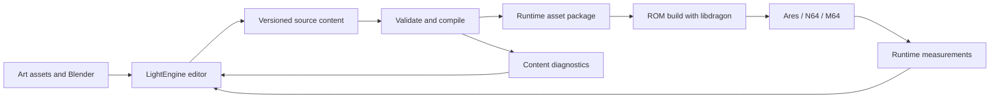

# Architecture

Status: proposed implementation direction, 2026-09-05. Only the [8 MiB memory requirement](decisions/0001-memory-baseline.md) is a recorded accepted technical decision. This document defines boundaries for the first implementation; it does not describe a running DarkLantern64 engine.

## Responsibilities

| Part | Responsibility |
| --- | --- |
| LightEngine extensions | Scene authoring, object inspectors, relationship editing, previews, validation feedback. |
| Shared content schema | Persistent identities, typed properties, asset references, and versioned authoring contracts. |
| Host content compiler | Validate, resolve defaults and references, convert assets, and emit target data plus diagnostics. |
| DarkLantern64 runtime | Game simulation, rendering integration, audio behavior, input, and level loading within target budgets. |
| libdragon fork | N64 platform services, SDK/toolchain integration, ROM packaging, and debugging support. |

This is a desired workflow diagram. Automated feedback into the editor is future work.

## Existing foundations

Read-only source inspection on 2026-09-05 found:

| Repository snapshot | Useful existing code | Implication |
| --- | --- | --- |
| LightEngine `046de4b9ac7dc4721a4cde3614555604b4b39987` | C++/Bazel/Vulkan; ImGui scene editing, play-scene cloning, Blender JSON/glTF export, and file-watching reload. See `src/editor/EditorUI.cpp`, `src/lightengine.cpp`, and `blender/lightengine_blender/export_scene.py`. | Extend a working desktop authoring foundation. |
| LightEngine, same snapshot | `src/scene/Scene.h` stores entity-indexed component arrays and imports editor/rendering/Vulkan types. `src/serialization/SceneWriter.h` does not persist entity IDs. | Introduce a portable content boundary and stable authoring identity. |
| libdragon fork `7a82f8e50e82ad4601d530801630d8bd0d2fcd00` | Windows support and Bazel hello-world ROM rules; see `WINDOWS.md`, `BAZEL.md`, and `bazel/rom.bzl`. | Reuse the toolchain work, then add game and asset targets. The prototype imports a locally installed SDK. |

These are inspection snapshots, not dependency pins or fresh build verification. An N64 backend, gameplay relationship editor, and DarkLantern64 content compiler have not been established by this inspection.

## Authoring model

Use the [Dark Object System research](research/thief-object-system.md) to guide a small, explicit model:

- **Entities:** persistent authoring IDs, display names, transforms, and typed properties. Renaming and reordering must preserve identity; duplication creates a new identity. Blender re-export needs a stable mapping for referenced objects.
- **Prototypes:** reusable default configurations such as a guard or door, with instance overrides. Begin with a single prototype parent.
- **Traits:** reusable bundles for capabilities or materials. The editor should show where an effective value came from. Define precedence before implementing inheritance; conflicting traits must never resolve by incidental file order.
- **Relationships:** typed source/destination IDs with optional data, suitable for a control-to-door connection or patrol route. Detect missing endpoints and invalid relationship types. Legitimate graph cycles, such as looping patrols, remain possible.
- **Surface semantics:** explicit gameplay materials for footstep sounds and interactions. Visual texture changes should not silently change gameplay material assignments.

Begin with only the property and relationship types needed for the first encounter. Editable text content with explicit schema versions should support review and migration. The exact schema and file layout are implementation decisions still to make.

## Compiled data and runtime state

The compiler should resolve static prototype defaults and references, assign compact runtime IDs, and retain a debug mapping back to authoring IDs. Shared immutable configuration can be deduplicated; mutable state such as awareness or door position belongs to each relevant instance.

Specify the binary format explicitly: version, byte order, alignment, field sizes, counts, bounds, and reference validity. Do not serialize native desktop structures or pointers directly. Quantization must have documented units and precision checks.

Cook geometry, textures, audio, collision data, and only the spatial data the first encounter requires. Validate unsupported material features before packaging. Emit resident-memory estimates and conversion diagnostics beside the assets; measure actual peak use in the runtime.

Schema and package versions must be checked during loading, with clear rejection of incompatible data. Source content remains authoritative; compiled outputs must be reproducible from declared inputs and pinned tools.

## Preview fidelity and platform boundaries

LightEngine's desktop renderer and physics can help authoring, but their results do not establish N64 performance or gameplay behavior. Where practical, reuse portable gameplay calculations in a desktop test host. Treat other previews as approximations and make the distinction visible.

Rendered lighting and the visibility model used by AI must reflect the same authored light state. A changing light cannot leave detection using a stale static bake. Sound events should carry gameplay meaning and use consistent attenuation rules for hearing and player feedback.

Keep Vulkan/editor dependencies outside the N64 target. The runtime should use bounded storage and measured work budgets. Rendering, simulation, and audio compete for platform resources even with expanded memory.

## Decisions to resolve through implementation

| Decision | Evidence needed |
| --- | --- |
| Renderer and libdragon revision | A representative room rendered and profiled on the target path. [Tiny3D](https://github.com/HailToDodongo/tiny3d) is a candidate and currently requires libdragon preview; it is not selected. |
| Display mode and frame target | Test 320x240 at a proposed 30 fps as an initial experiment; record results before adopting a budget. PAL timing remains to be specified. |
| Runtime language subset and shared code | Compile a small module with the chosen N64 toolchain; document supported dependencies. |
| Collision, navigation, and acoustic representation | The first encounter's movement, patrol, sight, and hearing requirements. |
| Build distribution | Extend the existing Bazel prototype while making SDK identity and asset dependencies reproducible. |
| ROM capacity, streaming, and saving | Measured content size, cartridge constraints, and game design needs. |

Implementation order and acceptance checks are in [First playable](first-playable.md).
