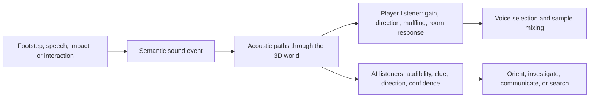

# Audio fidelity, acoustics, and hearing

Status: proposed design, researched 2026-09-05. Audio is a primary information channel for DarkLantern64: players should hear material, motion, distance, obstruction, and recognizable clues about nearby entities. AI should respond to the same events through a bounded acoustic simulation. This document extends the [N64 hardware guide](n64-hardware-guide.md); it does not describe an implemented audio engine. The checked SDK headers match our libdragon fork revision `7a82f8e50e82ad4601d530801630d8bd0d2fcd00`; upstream links below describe the implementations inspected on this date.

## What fidelity can the N64 achieve?

**Clear speech, recognizable material footsteps, stereo positioning, and convincing changes between rooms are achievable.** The N64 audio interface consumes **16-bit stereo samples** from memory and passes them to the audio DAC. CPU/RSP software prepares those samples. The output hardware does not force crude synthesis or heavily muffled recordings. [Nintendo: audio architecture](https://ultra64.ca/files/documentation/online-manuals/man/kantan/step2/3-1.html)

A 44.1 kHz, 16-bit stereo stream has the same nominal sampling format as CD audio. That is a format comparison, not a promise that lossy source assets, the mixer, or the console's analog output will sound identical to a CD player. Practical fidelity depends on recordings, source sample rates, compression, resampling, mixing headroom, effects, and presentation hardware. Raising output rate cannot restore information removed from an asset.

**Proposed evaluation:** compare 32, 44.1, and 48 kHz output using the same voice lines, quiet footsteps, metal transients, and ambient loops. The sample rate is configurable; 44.1 kHz is not a hard hardware maximum. Use `audio_get_frequency()` for the actual divider-derived rate. Higher rates process and transfer more samples for every active effect and voice. [Libdragon: audio API](https://libdragon.dev/ref/audio_8h.html)

For this game, preserve intelligibility and quiet detail before pursuing a headline sample rate. Use clean source recordings; avoid clipping the final mix; retain enough contrast that a meaningful footstep survives ambience. The goal is a believable, readable world rather than an intentionally degraded recording aesthetic.

## What the dedicated hardware supplies

| Part | What it supplies | What remains our responsibility |
| --- | --- | --- |
| AI and audio DAC | Timed stereo playback of prepared samples. | Making sure the next buffer is ready and contains the intended mix. |
| RSP | Programmable vector processing used by libdragon for mixing and resampling; suitable codecs/effects can also use microcode. | Scheduling audio alongside graphics and implementing any extra DSP we need. |
| PI and RDRAM | Asset transfers and sample/buffer storage. | Prefetching, decoder buffers, residency, and avoiding contention with world loading. |
| CPU | General game and control logic. | Sound events, acoustic paths, listener state, voice selection, and AI hearing decisions. |

There is no dedicated hardware room-acoustics or full 3D positional-audio engine that automatically understands our level. We supply that model. Libdragon's mixer provides **32 software channels**, left/right gain, panning, playback-rate control, and waveform callbacks. A stereo source consumes two channels. These are library capabilities, not 32 independent hardware voices with zero processing cost. [Libdragon: mixer API](https://libdragon.dev/ref/mixer_8h.html)

The checked mixer has no public per-voice room filter or reverb send. Those need a custom processing path, a mixer extension, or prepared sample variants. Since we own the libdragon fork, such extensions are available architectural choices; they still need profiling and branch/PR review when implemented.

### Two current implementation details to address early

The checked mixer microcode uses **point-sampled resampling**. Changing pitch or playing a source at a different rate can expose aliasing or roughness; an output stream labeled 44.1 kHz does not guarantee high-quality sample-rate conversion. Prefer offline resampling/low-pass preparation to the selected content rates and modest pitch variation initially. Evaluate a better interpolator as an explicit quality/performance option. Volume smoothing is not a substitute for sample interpolation or an acoustic low-pass filter. [Libdragon mixer microcode](https://raw.githubusercontent.com/DragonMinded/libdragon/trunk/src/audio/rsp_mixer.S)

The checked output driver sizes buffers at approximately **40 ms** each (`BUFFERS_PER_SECOND = 25`). Several queued buffers increase the time before a new event can become audible; changing the count alone does not shrink each block in this implementation. This is a library policy, not a 40 ms hardware limit. Prototype a smaller-block configuration and a shallow, reliably serviced queue, then measure under heavy graphics load. [Libdragon output driver](https://raw.githubusercontent.com/DragonMinded/libdragon/trunk/src/audio.c)

RSP high-priority work can take over between commands, not in the middle of an arbitrarily long command. Geometry submission must therefore leave sufficiently frequent opportunities to service audio. Protecting footstep and interaction latency is a reason to bound geometry tasks as well as total frame time. [Libdragon queue scheduling](https://libdragon.dev/ref/rspq_8h.html)

## Clear voices, muffled voices, and material clues

The acoustic impression should change in more than volume. A voice through a door loses intelligibility and high-frequency detail; a distant voice in an open hall has a different combination of direct sound and reflected sound. These are proposed authored approximations, not a full physical wave solver.

| Situation | Intended audible result | Affordable first approach |
| --- | --- | --- |
| Speaking guard in the same room | Clear words and stable direction. | Mono dry voice, distance gain, stereo panning, restrained room response. |
| Guard behind a closed wooden door | Quieter, muffled speech; some low-frequency energy remains. | Band-dependent transmission plus a prepared muffled variant or measured low-pass processing. |
| Door opens during the line | A continuous change toward a clear direct path. | Smooth path/filter parameters; keep the utterance timeline continuous. |
| Sound travels around a corner | The opening/corridor provides a useful directional clue. | Route through connected acoustic portals; use an apparent arrival direction rather than always panning toward the hidden true source. |
| Stone hall versus furnished room | Different reflections and decay. | A few authored room-response presets, initially with cheap shared effects or prepared tails. |
| Footsteps on stone, wood, carpet, or metal | Distinct attack, texture, resonance, and loudness. | Recorded variation sets keyed to gameplay surface, gait, footwear, and load. |
| Armored guard or another entity type | Learnable movement/sound signature. | Layer or select gear/stride cues without making every step an expensive stack of voices. |

Use a small number of frequency bands in the acoustic simulation—low, middle, and high are a reasonable starting model. Doors and materials can attenuate each band differently. The playback path maps that result to gain, muffling, and reflected/direct balance; AI can evaluate which parts remain audible without analyzing the final PCM samples.

**Prepared variants versus runtime filters:** variants are quick to audition and inexpensive to process, but consume storage and complicate continuity. Crossfading two synchronized variants temporarily consumes extra channels and decoding work. A runtime filter supports continuous door movement and many voices with fewer assets, but requires DSP, state per processed source, and quality tests. A global filter over the final mix is insufficient when one voice is behind a door and another is beside the player.

Room reverb should reinforce material and volume without masking quiet evidence. Start with a small shared room effect or a few short reflections, then compare it against dry playback. Long or many independent convolution responses are not a sensible starting assumption for the budget. Smooth transitions and let tails finish when their rooms stop being visible.

## Position, elevation, and the limits of stereo

Mono source assets make individual emitters easy to position and economical to mix. Compute direction in listener-relative 3D coordinates, then derive left/right gains and distance attenuation. Keep stereo assets for appropriate broad ambience or music, where a single point source is not the intended impression.

Simple stereo panning provides strong left/right information but does not uniquely encode front/back or height. Head rotation, room openings, obstruction, distance, and sound character help resolve those ambiguities. Do not claim precise headphone elevation from pan and volume alone. An HRTF renderer would be a separate software feature, with processing and listening-test requirements; it is not provided automatically by the AI hardware.

Our full 3D world needs floor/ceiling-aware acoustic paths. A guard directly above the player should not sound like an unobstructed nearby guard on the same floor. Footsteps transmitted through a ceiling can remain useful but uncertain clues. Stereo speakers, headphones, mono playback, original N64 analog output, and M64 output each need evaluation; avoid making essential gameplay depend on an optional surround decoder.

## One event, two consumers: playback and AI

Proposed event data includes a stable event/emitter ID, timestamp, XYZ source position, event class, source strength by band, duration, surface/gait or utterance reference, and deterministic variation seed. Use game-relative source strengths initially; they are not calibrated real-world sound-pressure levels. A walking action should emit the event at the foot-contact moment. That same event drives the sample and the hearing simulation.

The acoustic query computes path length, transmission/obstruction, arrival direction, and a compact room-response description for each relevant listener. Use broad-phase distance/room rejection, then bounded portal/path work; cache unchanged connections and invalidate them when a door or relevant occluder changes. A visual portal graph can help, but acoustic permeability is separate from visual visibility.

The AI consumer should receive an **audible clue with uncertainty**, not automatic knowledge of the emitter's exact hidden position or identity. It may distinguish a heavy step from a light one, or understand a nearby clear voice; muffled distant sound may justify only turning toward a doorway. Thresholds, masking/background noise, recognition, confidence, and reaction delay are gameplay rules to tune, not DAC features.

Keep playback scheduling separate from whether the sound occurred. If a decorative voice is omitted from the player's limited mix, that must not retroactively erase the world event for AI. Conversely, a loud UI notification or non-diegetic music should not alert guards. The two consumers share the physical event and acoustic model while retaining their own listener capabilities and presentation rules.

## Sample storage, compression, and voice budgets

Memory is an explicit design constraint. The [audio memory planner](audio-memory-planning.md) separates encoded storage, resident banks, persistent playback pools, decoder/effect state, output buffers, and transition peaks. Its illustrative envelope is not yet the game's accepted audio allocation. The channel-count experiment below must be evaluated against that memory ledger as well as processing time.

Calculated uncompressed 16-bit PCM sizes, before headers and alignment:

| Sample rate | One second mono | One second stereo |
| --- | ---: | ---: |
| 22.05 kHz | 44,100 bytes | 88,200 bytes |
| 32 kHz | 64,000 bytes | 128,000 bytes |
| 44.1 kHz | 88,200 bytes | 176,400 bytes |
| 48 kHz | 96,000 bytes | 192,000 bytes |

Thirty seconds of 44.1 kHz stereo PCM is **5,292,000 bytes**, about 5.05 MiB. Long ambience or dialogue should not casually occupy that much resident memory. Short repeated cues can be resident; larger banks can be streamed/prefetched in bounded chunks. Preserve lossless high-quality masters and cook target assets separately.

Libdragon's WAV64 conversion offers compressed sample playback, with VADPCM as the documented default conversion. It is lossy: audition quiet speech, sibilants, footsteps, looping tails, and sharp metal sounds after conversion. Savings in ROM and input traffic do not eliminate decoder or decoded-buffer costs. [Libdragon: WAV64](https://libdragon.dev/ref/wav64_8h.html)

The checked VADPCM format stores 16 mono 16-bit samples in 9 bytes: **about 3.56:1 payload compression**, before codebooks, headers, and padding. At 32 kHz that is about 18,000 bytes/s of compressed mono payload; at 44.1 kHz, about 24,806 bytes/s. Keep raw PCM as an option for critical assets that fail listening tests. [Libdragon VADPCM frame definitions](https://github.com/DragonMinded/libdragon/blob/trunk/tools/audioconv64/vadpcm/vadpcm.h)

The installed converter also offers an Opus/CELT path. In the checked implementation it uses 48 kHz, 20 ms frames and custom WAV64 framing, with additional decoding work and restricted seeking. Evaluate it for long ambience or music after profiling. Its bitrate-dependent savings and framing should not be generalized to every reactive sound or arbitrary Ogg Opus file. [Libdragon audio converter](https://github.com/DragonMinded/libdragon/blob/trunk/tools/audioconv64/conv_wav64.c)

Generic mixer position control does not guarantee cheap random seeking in every compressed player. The checked VADPCM reader supports start/loop-start seeks, and the Opus reader supports restarting. Before implementing virtualized dialogue resume or a mid-line switch to a filtered variant, choose an explicit strategy: resident PCM for short critical lines, synchronized variants, independently seekable chunks, or decoder checkpoints. Source asset formats and playback must agree. [Libdragon VADPCM reader](https://raw.githubusercontent.com/DragonMinded/libdragon/trunk/src/audio/wav64_vadpcm.c), [Opus reader](https://raw.githubusercontent.com/DragonMinded/libdragon/trunk/src/audio/wav64_opus.c)

**Proposed first workload:** 12–16 actively mixed mono-equivalent channels, with room for important speech, close footsteps, interactions, and a restrained ambient bed. This is a starting experiment, not a measured N64 limit. Stereo assets and overlapping variants count against the channel total. Compare the same mix at different output rates and while the 3D renderer is busiest.

Voice priority should consider gameplay importance, audibility, distance, novelty, and continuity. Reserve capacity for information-bearing cues rather than allowing distant ambience to consume everything. Virtualize inaudible looping emitters while retaining their logical timeline when the format supports suitable resume behavior. Do not restart a guard's spoken line whenever a channel becomes available. Apply gentle gain changes and preserve mix headroom to avoid clicks or clipping.

## Editor workflow and acceptance

LightEngine should offer an acoustic material inspector, auditionable footstep/voice sets, listener placement, acoustic-portal overlays, and a sound-event log. A debug view should distinguish source position from perceived arrival direction and show why a listener heard, failed to hear, or misunderstood an event. These are proposed features.

Author surface acoustics independently of the visual texture: changing a wood texture should not silently turn wooden footsteps into stone. Store utterance/event metadata separately from its waveform so art revisions preserve gameplay references. Include original and target-compressed audition modes, clipping/loudness diagnostics, memory/streaming estimates, and simultaneous-voice reports.

| Acceptance scene | What it must prove |
| --- | --- |
| Walk/run/crouch across four materials | Recognizable surfaces, plausible loudness changes, matching AI hearing consequences, variation without obvious repetition. |
| Guard speaks while a door opens/closes | Clear-to-muffled continuity, no restarted phrase, sensible perceived direction, corresponding AI audibility. |
| Footsteps above/below the player | Correct 3D separation and obstruction; no misleading same-floor direct sound. |
| Several nearby cues during ambience | Important information survives voice selection and mixing; no clipping or constant ambient masking. |
| Pursuit passes from room to courtyard | Continuous emitter identity, room response, sound propagation, and AI behavior. |
| Heavy graphics plus audio and asset loading | Bounded event-to-output latency, no underruns, acceptable codec/resampling quality and memory peaks. |

Log event time, selection time, mix-buffer position, and scheduled output time; verify actual audible latency on hardware as well. Frame rate alone cannot tell us whether a footstep is heard promptly. Keep separate results for original N64 and M64, and test without an emulator's enhancements.

The current prototype uses placeholder synthesized sounds. Recorded sample playback, acoustic filtering, material sets, room response, and this shared event/path system still need implementation. The N64 hardware supports pursuing them; the next step is a small audio-focused encounter with real target-format assets and measured latency/processing cost.
