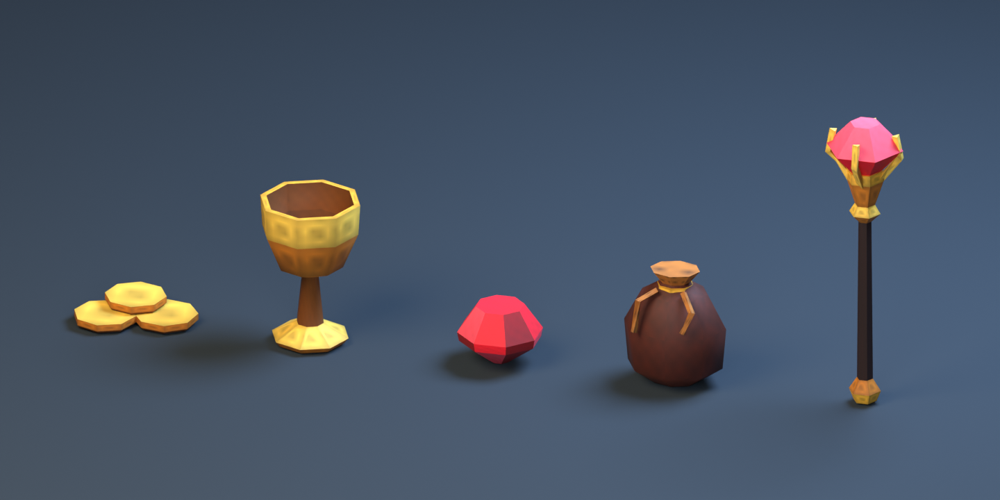
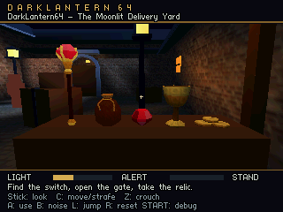

# Blender props: edit, export, place, play

The Blender asset pipeline turns saved mesh objects into reusable props for the LightEngine level editor and the N64 game. Start with `art/loot.blend`: coins, a goblet, a jewel, a purse and a scepter. These are static modeled props; collectible behavior is separate future work.



## Try the included props

All three bundled levels contain the five assets. The Lantern Store and Enemy Patrol Workshop have coins, a goblet and a purse on the rotated crate, with the jewel and resting scepter on the raised platform. In Moonlit Delivery Yard, all five sit on a merchant's counter under the shelter, lit by a small hanging lamp.

In the editor's **Levels** panel, open **Moonlit Delivery Yard**, choose **Blender loot counter** in **Test start**, then **Play level**. Alternatively, **DarkLantern64: Launch game** opens the level selector: choose Moonlit Delivery Yard and use left/right to select **Blender loot counter**. The other rooms also offer a **Blender loot crate** start.

```powershell
python tools/build.py --level content/moonlit_courtyard.json --start-preset loot-counter --run
```



This is the game's raw 320×240 framebuffer before VI filtering. Blender's image above uses studio rendering; the Ares image is the appearance delivered by the current ROM.

## The everyday loop

1. From a terminal in the repository root, run `python tools/blender_assets.py --open`. Edit the meshes, UVs or atlas, then save the `.blend` file.
2. Run `python tools/blender_assets.py`. Blender runs in the background and writes `content/assets/loot/pack.json`, OBJ meshes and the texture image. This reads the saved source and does not change any level.
3. Use **DarkLantern64: Launch editor**, then open the desired level through **Levels**. In **Room Objects → Asset packs / props**, set **Pack URI** to `assets/loot/pack.json` and click **Import asset pack**. Choose the **Prefab**, then click **Place prop**. The manifest path is relative to `content/`.
4. Place the instance in Object Properties. **Save + Cook** creates its viewport model; select that model in Entity List to use the transform gizmo. Position uses metres, with **Y up**.
5. Use **Play level** to save and launch that level, or **Play game menu** to save it and launch the bundle. Check the result in Ares under the level's actual lighting.

For another asset pack, use a different source and destination:

```powershell
python tools/blender_assets.py --source art/furniture.blend --output content/assets/furniture
```

The exporter requires Blender to be installed, but does not require the add-on to be installed in your personal preferences. It checks `--blender`, then `BLENDER_EXE`, then PATH and common installations, including Steam's Blender directory. To select a particular installation:

```powershell
python tools/blender_assets.py --blender 'C:/Program Files (x86)/Steam/steamapps/common/Blender/blender.exe'
```

Save Blender edits before a command-line export and save editor edits before building the game. Exporting a source model updates files shared by every level that references them; placement remains level data. When only geometry or image contents change at the same paths, Save + Cook refreshes them.

The prefab catalog lasts for the editor session: import the same pack again after reopening or reloading to place more instances. Placed props and their asset/material references persist in the saved level. Identical definitions import again safely; changed definitions under existing IDs are rejected. Adjust an existing imported material in the editor, or give a new material/asset a new ID when introducing a different definition. **Delete prop** removes a selected decorative instance.

## Author an exportable prop

Use ordinary Blender mesh objects. Each exported object needs an Object custom property named **`dl64_asset_id`**, such as `loot-goblet`. Each object's material needs a Material custom property named **`dl64_material_id`**, such as `mat-loot-atlas`. Keep these IDs stable so later exports update the same assets. Use ASCII letters, digits, hyphens and underscores, beginning with a letter; IDs must be unique within their category, including when compared without letter case. Re-export a pack to its original folder. To create a separate pack with different paths or definitions, choose distinct IDs so it cannot overwrite another pack's assets.

The command-line exporter exports every mesh in the active scene with `dl64_asset_id`. Cameras, lights, and untagged presentation meshes are excluded. Put an object's origin where its placement pivot should be, usually at its bottom centre. Blender's object translation is removed during export, so arranging the props beside one another for inspection does not bake that layout into each asset.

Work in metres and Blender's normal **Z-up** coordinates. The exporter accounts for scene unit scale, bakes object rotation and scale, and converts coordinates to the game's Y-up system: Blender `(x, y, z)` becomes game `(x, z, -y)`. Do not manually apply an additional axis conversion. Move vertices in Edit Mode to change the shape relative to the pivot; use the level editor to choose an instance's world position, rotation and scale.

Meshes are evaluated and triangulated at export. Keep the result economical: visible triangles, texture changes and shading work matter on the N64. The level compiler checks the resulting level's limits. These initial props are decorative and have no automatic collision or pickup logic.

**Smooth surfaces:** use Blender's smooth face shading and sharp edges to control the result. The exporter now preserves evaluated corner normals through OBJ into both the LightEngine preview and N64 renderer. Keep intended creases sharp; the example smooths the goblet's bowl/stem and pouch body while retaining the goblet's lip/base and the purse's trim. This changes shading without subdividing the mesh. The silhouette retains its low-poly outline.

**Loot visibility:** enable **Loot highlight** in Object Properties, or **Highlight new prop** when placing a prefab. Existing example loot has it enabled. The game applies a 3.6-second brightness pulse that fades with distance. Its amplitude is four times the initial subtle prototype: the shading lift runs from 14% to 78%, with the same dimmest level and timing. This presentation effect adds no particle geometry or scene light and does not affect guard detection. The LightEngine viewport shows the base material; inspect the animation in Ares. For automation, pass a boolean `loot_highlight` to `add_prop` or `set_entity`; it defaults to false on newly authored objects.

## Materials and texture budget

Use **one material slot per prop**, with a Principled BSDF and either a constant Base Color or a direct **Image Texture Color → Principled Base Color** connection. Textured faces need UVs. Image textures use Flat projection and Repeat wrapping. Use opaque materials.

Texture width and height must each be a power of two from 1 to 64, and `width × height × 2` must fit within **4,096 bytes**. For example:

| Texture dimensions | RGBA16 pixel storage |
| --- | ---: |
| 16 × 16 | 512 bytes |
| 32 × 32 | 2,048 bytes |
| 64 × 32 | 4,096 bytes |

The five example props share one **32 × 32 atlas**, so their unique decoded pixel data totals **2 KiB**. Sprite headers, allocations, geometry and renderer buffers consume additional memory. Sharing the atlas across instances does not create a separate texture allocation for every prop.

| Prop | Triangles | Cooked vertices including UV/normal seams | Normal bytes | Geometry bytes |
| --- | ---: | ---: | ---: | ---: |
| Coin cluster | 132 | 240 | 0 | 5,592 |
| Goblet | 156 | 304 | 912 | 7,928 |
| Jewel | 60 | 112 | 0 | 2,600 |
| Purse | 160 | 304 | 912 | 7,952 |
| Scepter | 180 | 360 | 0 | 8,280 |
| **One complete set** | **688** | **1,320** | **1,824** | **32,352** |

Geometry bytes count float XYZ positions, float UVs, 16-bit triangle indices, and optional three-byte signed normals. The atlas's cooked sprite is 2,184 bytes including its header. These numbers exclude renderer working buffers, instance records, and lighting caches. Repeated instances within one level share source geometry, but each visible instance still costs transform/drawing work. Current bundle compilation stores geometry separately for each level: the three copies of this set therefore occupy 97,056 geometry bytes. The packaged atlas is deduplicated across the bundle.

The updated courtyard totals 3,242 instanced vertices and 1,788 triangles, below the current 4,096 limits. Its existing lighting cache also carries the smooth vertex colors. The older store lighting path allocates 4,864 bytes of additional color cache for its 608 smooth vertices. Treat the high seam count as an optimization opportunity when adding many props; these are first-pass meshes, not a maximum-density loot benchmark.

Constant emission is supported when each resulting channel, **Emission Color × Strength**, is between 0 and 1. Bright gold or polished surfaces should get their basic color and highlights from the small atlas and mesh shape. The game uses its own geometric lighting. Metallic/roughness values are authoring-only; linked PBR maps, procedural shader graphs and runtime specular shading are outside this initial exporter. Unsupported inputs fail export with a named error instead of quietly promising Blender's full material appearance.

The N64 cook quantizes the exported image to RGBA16. Inspect both the cooked desktop preview and Ares; Blender's studio lights and renderer are an authoring view. See the [texture pipeline](texture-pipeline.md) and [hardware notes](n64-hardware-guide.md) for the wider rendering constraints.

## Optional Blender export menu

Run `python tools/blender_assets.py --package-addon` to create `build/darklantern64_export.zip`. Install that ZIP through Blender's add-on preferences and enable **DarkLantern64 Asset Pack**. Packaging does not install it or change preferences automatically. The [developer tools guide](developer-tools.md) collects these commands alongside captures and verification.

Select the intended meshes and choose **File → Export → DarkLantern64 Asset Pack (.json)**. Set **Content Root** to this repository's `content` directory and save the manifest as `pack.json` inside a named pack folder, such as `content/assets/loot/`. The same export validation applies. The command-line workflow remains available if you prefer keeping Blender's setup unchanged.

## Automation and source ownership

`art/*.blend` contains editable source. `content/assets/<pack>/` contains exported OBJ, image and manifest files used by levels. `build/` contains derived previews and ROM data. Keep the source and exported assets together in version control; do not edit generated OBJ files as the normal modeling workflow.

The editor API also supports these operations, with JSON arguments passed through `tools/editorctl.py --args-file`:

```json
{"uri":"assets/loot/pack.json"}
```

Use that payload with `import_asset_pack`. To place an imported prefab, pass `add_prop` a payload such as:

```json
{"prefab":"loot-goblet","id":"desk-goblet","position":[1,0.8,2],"rotation":[0,25,0],"scale":[1,1,1]}
```

Use the exact prefab IDs listed in the exported `pack.json`. For everyday project editing, omit `--level`; commands target the active level through the project queue. Import and placement are editor changes; finish with `save` or the **Save + Cook** button.

`python tools/blender_assets.py --make-demo` rebuilds the supplied example from its generator. It replaces `art/loot.blend` and its exports, so save personal modeling changes to a different `.blend` file before running it. Ordinary export with `python tools/blender_assets.py` preserves the source file.

## Verified integration

The [initial integration results](loot-assets-results.json) and [visual polish results](loot-visual-results.json) record source/ROM hashes, mesh costs, and checks. Blender 5.3 Alpha passed saved-source export, complete regeneration, UV/winding/unit conversion, packed-image reopening, and failed-export preservation. The updated smooth normals, pouch UVs, and red ruby palette also regenerate byte-identically.

The LightEngine integration passed import, duplicate/conflict handling, prop placement, Save + Cook, gizmo editing, highlight toggling, deletion, and reload. The project host checks passed, including 119 Python tests plus C normal-transform/pulse checks. Ares captured both rooms and two pulse phases, completed the original mission replay, rejected a 4 MiB launch as expected, and exercised all eight bundled default/named starts through 48 launches/restarts and 24 resumes. Per-start sampled heap remained stable across repeats. Capturing framebuffers forces synchronization, so capture timings are not performance measurements. Original N64 and M64 testing is still pending.

For reproducible animation captures, an authored view may include `"animation_time": 0.9` (seconds, 0–3600). This selects the visual phase while gameplay stays frozen; it is not a simulation fast-forward or saved state. The courtyard's `loot-pulse-phase-a` and `loot-pulse-phase-b` views demonstrate it.
