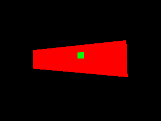
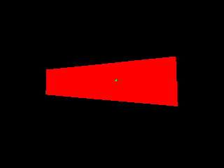
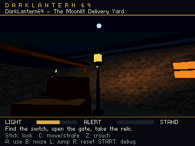

# Fixing the Tiny3D window depth regression

The isolated courtyard test now keeps every expected window pixel visible in
all 120 cases at the game's original 12 cm near plane. The fix refines the RSP's
approximate reciprocal and increases viewport scaling precision. The window's
geometry and 47.5 mm separation from the warehouse wall are unchanged.

The following raw framebuffer captures use the same 10 m camera, −30° incidence,
12 cm near plane, and wall-first draw order. Green is the window; red is the wall.

| CPU reference | Previous Tiny3D | Corrected Tiny3D |
| --- | --- | --- |
|  |  |  |

## What went wrong

The original RSP vertex path used the hardware reciprocal approximation
directly in perspective division. At a failing camera, the observed reciprocal
error reached 0.144%. Multiplication by a projected depth near 32767 magnified
this into inconsistent errors exceeding 22 depth units between vertices. The
real window/wall gap at 10 m represents only about two depth units. That numerical
error was enough for the wall to win the depth test even though it was behind
the window.

For one window vertex the float reference depth was 32412.826; the RSP stored
32435. Recalculating only the reciprocal from the captured clip-space values
reduced the reconstructed error to 0.169 units. Across all 36 sampled wall/window
vertices, the same reconstruction left errors between approximately −0.171 and
+0.691 units. The original modelview and packed vertex precision therefore did
not explain the dominant error at that camera.

The first hypothesis was loss of fractional vertex depth: Tiny3D stores integer
vertexZ before triangle setup, whereas the CPU path retains fractions while
calculating gradients. That remains a possible limit for other content, but a
controlled CPU variant that deliberately discarded the same depth fractions
still passed every case in this fixture. The actual cache observations pointed
to reciprocal accuracy first. A larger near plane improved the old renderer
but did not remove the failure, so it was not selected as the fix.

## The change

The candidate refines the approximate half reciprocal using a Newton correction
in both ordinary vertex transformation and the clipping path. The calculation
preserves extra fractional precision in its residual and rounds the correction
before returning to the existing 16.16 representation. It keeps the existing
36-byte transformed vertex format and 70-vertex cache.

The candidate also incorporates the viewport portion of upstream
[5392d6e](https://github.com/HailToDodongo/tiny3d/commit/5392d6ed26b7d52da7b11d4c85cc68cdc8d364ce):
screen scale uses eight fractional bits instead of four, the CPU derives its
scales from the quantized W normalization, and depth scaling is bounded. This
change alone did not solve the window problem; together with the refined
reciprocal it removed the remaining distant-case failures.

The staged microcode occupies 3848 bytes for the ordinary overlay and 2840 bytes
for the clipping overlay. It removes the unused native RSP point-light routine
to make room and rejects that API explicitly. DarkLantern64 continues to use
its existing CPU lighting and two body probes per guard. No SDK installation or
global SDK modification is required. The dependency patch and its generated
assembly must remain tracked and fingerprinted together.

## Measured evidence

The fixture retains the actual positive localZ source faces: sixteen warehouse
triangles and two window triangles. Sixty cameras cover 3, 6, 10, and 18 m;
−60°, −30°, 0°, 30°, and 60° incidence; and three small position jitters. Each camera
tests both draw orders against that renderer's own window-only mask.

| Variant, all at 12 cm near | Cases with lost window pixels | Total lost pixels |
| --- | ---: | ---: |
| CPU reference | 0/120 | 0 |
| Previous Tiny3D | 66/120 | 2799 |
| Viewport correction alone | 66/120 | 2809 |
| First reciprocal refinement | 5/120 | 32 |
| Refined reciprocal | 2/120 | 5 |
| Refined reciprocal + viewport correction | **0/120** | **0** |

Diagnostic 24 cm and 40 cm near planes also passed with the final candidate, but
the game retains 12 cm. The armband issue was separate: its surface actually
intersected the sleeve and required a mesh correction. No art offset was used
to hide the warehouse/window regression.

[Durable evidence](evidence/depth-precision-study.json) records the ROM and
library hashes, source inputs, all variant summaries, cache observations, and
representative-image provenance. Full per-camera reports remain under
`build/depth-study`. See the [fixture instructions](../tools/tiny3d/depth-study.md)
for reproduction and additional diagnostic selectors.

This is a correctness result in Ares for the stated geometry and cameras. It is
not a claim that every possible close surface is immune to depth artifacts or
that real-console validation has occurred. The fixture deliberately waits for
graphics completion and reads pixels; its timings must not be used as a game
performance measurement. The separate production verification passed 1,800
fresh presentations over 1,800 observed VIs with no repeats in 30.087 seconds.
CPU work averaged 11.688 ms and peaked at 16.480 ms, with no work sample over the
60 fps budget. Its exact ROM, patch, and library hashes are in the evidence.

All seven authored courtyard views were also captured and visually inspected
under the production renderer, including textured roofs and walls, the lit
window, the closed/open doorway, and loot closeups. No broken geometry or
clipping was apparent in those images. This is a static-view review, not an
exhaustive guarantee for every player trajectory.

Implementation references: [pinned vertex transform](https://github.com/HailToDodongo/tiny3d/blob/ec557373e986b5e041cc102a7ff787eb07921937/src/t3d/rsp/rsp_tiny3d.rspl),
[pinned clipping transform](https://github.com/HailToDodongo/tiny3d/blob/ec557373e986b5e041cc102a7ff787eb07921937/src/t3d/rsp/clipping.rspl),
and [libdragon CPU triangle gradients](https://github.com/DragonMinded/libdragon/blob/trunk/src/rdpq/rdpq_tri.c).
