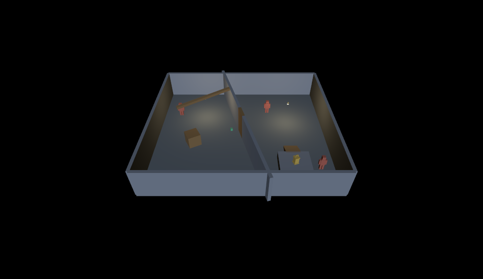

# Enemy placement and behavior

Designers place enemies, choose their type, and author their routes in the project editor. Code defines reusable enemy types. Save + Cook carries these choices through the LightEngine preview and generated N64 level data; Play level builds and launches the result in the game.

## Try the workshop

The separate [Enemy Patrol Workshop](../content/enemy_patrols.json) contains the original store patrol, a Scout following three points in the workroom, and a Watchman sentry in the store. It reuses the fully 3D placeholder models and does not change the original mission or courtyard.



Use **DarkLantern64: Launch editor**, then open **Enemy Patrol Workshop** through **Levels**. Edit enemies and routes, then use **Play level** to save, cook and launch the result. Equivalent command-line access remains available:

```powershell
python tools/build.py --editor --run
# Open Enemy Patrol Workshop in Levels before saving
python tools/editorctl.py save
python tools/build.py --run --level content/enemy_patrols.json
```

Save and close an old editor before rebuilding that same editor executable on Windows. Keep one project editor open and switch levels inside it. See the [creator guide](creator-guide.md#place-enemies-and-author-patrols) for the placement steps.

## What designers control

Each enemy has its own stable ID, XYZ placement, facing, type, behavior, patrol route and optional speed/sight/hearing overrides. New enemies default to Sentry, so a designer can place a valid enemy before drawing its route. Sentries hold their post and return after an investigation; patrol enemies loop through their ordered waypoint IDs. Both detect the player, investigate audible events, search and chase independently.

Patrols need 2–32 entries. Sentries may retain 0–32 entries while a route is being assembled; those entries are inactive until the behavior changes to Patrol. Removing an entry through the UI changes the enemy to Sentry if fewer than two remain. Patrol points are actual XYZ entities that appear as editor markers after cooking. They do not become visible geometry in the game.

Duplicate enemy creates new waypoint objects so route edits are independent. Repeated references in a route remain repeated references to one cloned point. The automation command accepts a new position and translates the copied route by the same offset. The UI duplicates at the source position; designers move the copy and its points afterward. Appending an existing waypoint deliberately shares it. Removing a route entry leaves the waypoint available; deleting a referenced waypoint is refused.

Structural edits appear in Room Objects immediately. **Save + Cook refreshes added/deleted viewport objects.** Existing transform edits use the normal gizmo round trip. The local automation API exercises the same canonical mutations as the UI; its payloads are documented in the [editor reference](../editor/README.md).

## Code-defined types and cooked data

The shared catalog is [src/enemy_types.def](../src/enemy_types.def). Each row supplies a C enum symbol, stable content ID, editor label, and defaults in metres and seconds:

| Type | Speed | Sight range | Hearing range |
| --- | ---: | ---: | ---: |
| Watchman | 0.8 m/s | 6.5 m | 7 m |
| Scout | 1.1 m/s | 8 m | 8 m |

Both are initial tuning variants of the same humanoid AI and use the same placeholder model. The catalog is a starting point for additional code-defined abilities and enemy families. The existing explicit per-instance values in old levels still take precedence. In the editor, **Use type default** removes that override. Catalog changes are included in cook/build fingerprints; recook and reopen the editor after changing code defaults.

Version-2 source remains compatible: `kind: "guard"` defaults to type `watchman` and behavior `patrol` when those fields are absent. The compiler validates every route reference and emits one definition and waypoint array per enemy. Every guard model receives an explicit enemy index; rendering reads that particular enemy's position, facing and lighting. `level_report.json` includes `enemy_types`, ID-keyed `enemy_instances`, and enemy/route counts.

The runtime stores a bounded array of enemy state alongside one shared player and world. On the N64 build, this array reserves **832 bytes for 16 slots**, separate from immutable enemy definitions, route arrays, model/lighting data and audio bookkeeping. It does not duplicate the level, collider or lighting data per actor. Footstep and investigation sounds use each actor's position; the existing four-voice placeholder mixer remains bounded and still needs cue prioritization for busy encounters. The alert bar shows the greatest awareness, the minimap marks every enemy, and debug text shows enemy count plus how many currently see/hear. Emulator logs include stable IDs and independent positions, states and route indices.

## Current limits

- **16 enemies is a capacity limit, not a measured frame-rate guarantee.** Geometry still shares the 128-model/4096-instanced-vertex/4096-triangle limits. More visible guards cost both AI and rendering time; use the profiler on the actual encounter.
- Routes follow straight segments with existing upright-box collision and step/gravity handling. There is no navigation mesh, path search around obstructions, crowd avoidance, or guard-to-guard collision. Keep route segments and the closing loop clear, and separate starting positions.
- There are no per-waypoint waits, scripted actions, route branches, squad communication or distinct animation sets yet. A Sentry supplies the first stationary assignment without needing scripting.
- Perception and behavior remain active for offscreen enemies. Render culling does not silently disable simulation. The previous [scale study](scaling-guide.md) is historical evidence for workload cost, not a benchmark of a populated multi-enemy level.

## Verification

`python tools/build.py --test` covers compiler contracts, independent runtime behavior, the original input-only mission and existing profiling/culling tests. `python tools/verify_enemy_editor.py` starts its own built scene editor on a new content file, exercises creation, route duplication, sentry conversion, safe deletion, defaults and gizmo persistence, then saves evidence under that scene's `.dev/editor/scenes/` directory. It never overwrites existing source or closes another editor. On success or failure, it archives the generated test content under the session's `evidence/` directory and removes its owned source from `content/`.

`python tools/smoke_ares.py` verifies the original mission and Expansion Pak gate. `python tools/smoke_enemies.py` verifies that both workshop patrols move through their own route indices while the undisturbed sentry stays at its post in the ordinary ROM. `python tools/capture_ares.py --level content/enemy_patrols.json` exports two authored N64 views of the populated workshop. Captures freeze simulation and are not movement or performance measurements. Original N64 and M64 validation remains pending.

The [2026-09-05 verification record](enemy-authoring-results.json) includes source/ROM hashes, editor checks, N64 captures and per-enemy Ares telemetry. All 70 Python tests and 23 gameplay regression groups passed, along with the original mission, 30 benchmark cases, profiler and culling checks. The actual editor creation/duplication/save/gizmo round trip and ordinary three-enemy Ares smoke test also passed.
