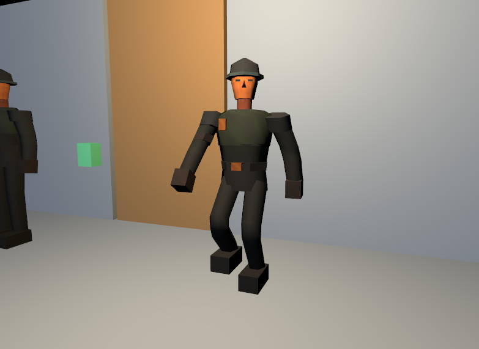
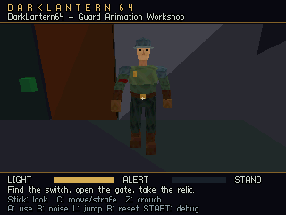
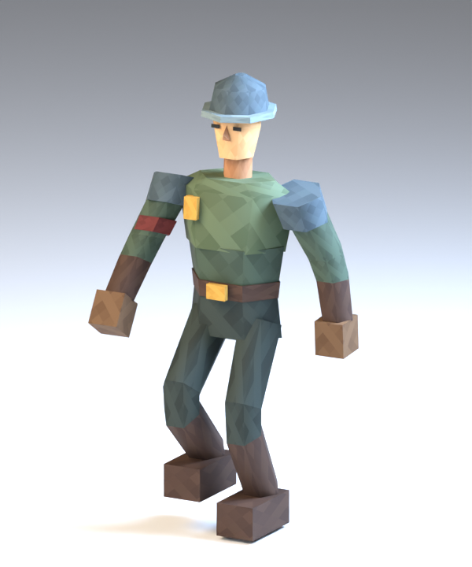

# Guard animation prototype

The first animated guard proves the Blender → cooked asset → LightEngine → N64 ROM path. It has **20 bones, five editable Actions, a 32 × 32 texture atlas, and connected elbow and knee geometry**. Simple compression reduces its animation keys from **120,400 to 8,820 bytes** with a maximum sampled vertex error of **0.144 mm**.

This began as a correctness and budgeting experiment. The initial CPU reference renderer took about **99.64 ms per frame, roughly 10 fps**, in the measured two-guard workshop. That historical measurement establishes the asset workflow, not a production guard budget. The subsequent Tiny3D backend and its performance acceptance criteria are described in [Guard renderer architecture and performance evidence](guard-renderer-performance.md). Original N64 and M64 testing remains pending.

## Try the guard

1. Run **DarkLantern64: Launch editor** and open **Guard Animation Workshop** in **Levels**.
2. Select **animated-sentry** or **animated-patrol** in **Room Objects**. Expand **Character animation** in **Object Properties** and click **Focus guard**.
3. Choose `idle`, `walk`, `run`, `notice`, or `turn` in **Clip**. Use **Play animation**, **Pause animation**, **Reset pose time**, and **Time (seconds)** to inspect the movement. A new clip starts paused at zero.
4. Under **Blend preview**, choose **Blend toward** and adjust **Blend weight**. Both clips sample the displayed time; this is a transition experiment, not a full animation-state editor.
5. Adjust **Attention yaw** (±45°) and **Attention pitch** (±25°). These apply a bounded head rotation after the authored pose. They work with Blender's bone orientations and do not change saved behavior or AI perception.
6. Click **Play level** to save, cook, build, and launch the workshop in Ares. One guard patrols; the other holds a sentry post. The ordinary game controller blends idle and distance-driven walking. `run`, `notice`, and `turn` are available in the editor and diagnostic captures; they are not yet mapped to gameplay states.

Preview controls are temporary. They do not write animation poses into the level. The desktop uses the same cooked integer keys and portable C pose sampler as the N64; lighting still comes from LightEngine. The connected mesh preview skins vertices in place. Repeated playback and seeking reuse the instance's mesh allocation. LightEngine's fixed-topology update and orbit-focus changes are published in [PR #17](https://github.com/hughes/LightEngine/pull/17), pending review; the project pins the tested commit.





## Edit and export in Blender

The artist source is [art/guard.blend](../art/guard.blend). Open it directly, or run:

```powershell
python tools/guard_assets.py --open
```

The Actions are named **Guard | idle**, **Guard | walk**, **Guard | run**, **Guard | notice**, and **Guard | turn**. Use Blender's Action Editor to choose one, select the armature in Pose Mode, and edit its keys. The supplied source uses explicitly linear sampled channels. A hidden, excluded copy retains the earlier disconnected study mesh; the tagged connected mesh is the exported character.

Keep stable bone names and the Action custom properties `dl64_clip_id`, `dl64_frame_start`, `dl64_frame_end`, `dl64_loop`, and `dl64_stride_length`. Loop ranges include a final pose matching the first. `foot-left` and `foot-right` pose markers identify contacts; do not duplicate a marker at the loop endpoint. The exporter evaluates the selected frame range at the scene frame rate, currently 30 Hz.

**Save the `.blend` before exporting.** The command reads the saved file in a background Blender process:

```powershell
python tools/guard_assets.py
```

This exports [guard.character.json](../content/assets/guard/guard.character.json) and [guard-atlas.png](../content/assets/guard/guard-atlas.png). Return to the project editor and use **Save + Cook** to refresh the preview, then **Play level** to test the ROM. The supplied workshop already references these assets, so no new prefab import is needed.

The exporter is currently tailored to this guard's tagged mesh, rig, named hand/head sockets and first material. It requires applied mesh/armature object transforms, one full-strength bone assignment per vertex, UVs, and rigid bone transforms. Extra weights and animated scale are rejected. Constraints can help author motion, but the current exporter traverses all bones in this rig; it does not strip a separate control rig. Keep the exported rig within the 32-bone limit. General character import, retargeting, richer materials and a reusable animation-export UI remain future work.



## Asset contract and game binding

The version-1 character JSON uses metres, right-handed XYZ, +Y up and +Z forward. It contains parent-first local bone translations and XYZW quaternions, a model-space bind mesh, one bone index per vertex, endpoint-inclusive sampled clips, semantic events and sockets. The cooker derives inverse bind transforms. Source UV V grows upward; the cooker converts it once for the existing target texture path.

Levels use a typed asset and the usual model reference:

```json
{"id":"mesh-guard","type":"character","uri":"assets/guard/guard.character.json"}
```

An entity's `model` is `mesh-guard`; its `material` selects the atlas material. Placement, enemy type and patrol references stay in the level. Animation data stays in the shared character source. The [workshop source](../content/animation_workshop.json) is the complete example. Ordinary and bundled builds emit character geometry, skeletons, clips and sockets once per content hash; guards and levels share that immutable data.

The cooker emits bind meshes, per-bone preview meshes, a complete connected preview mesh, compressed clip metadata and memory/error reports. The complete mesh is used when triangles span bones. Generated preview data lives in `build/project/editor-assets/characters/<level>/<asset-id>.json`; `build/` is disposable.

## Connected joints and the N64 vertex cache

Each vertex follows one bone, while a triangle can join vertices following different bones. Our four elbow/knee connections use **48 mixed-bone triangles**, twelve per joint. This creates a continuous connection without adding blended vertex weights. The rest of the mesh contributes 483 triangles.

Kaze describes the applicable N64 technique at approximately 13:38–14:05: transform one vertex group with one matrix, another group with another matrix, then connect the retained results. Nintendo's `gSPVertex` reference explicitly states that cached vertices retain their transformed positions when the matrix changes, and identifies joints as a use case. [Kaze's explanation](https://www.youtube.com/watch?v=xwls5SpNn1s&t=818s), [Nintendo `gSPVertex` reference](https://ultra64.ca/files/documentation/online-manuals/man/n64man/gsp/gSPVertex.html)

Fast64 provides working exporter examples: its F3D writer groups vertices by limb, loads matrices and vertices, then emits triangles. Its SM64 seam exporter also checks connecting-vertex capacity and accounts for UV/normal/material splits. These informed the design; our Tiny3D path uses the project's own batch builder. [Pinned F3D implementation](https://github.com/Fast-64/fast64/blob/44b7bd9603382f1ac7c0d1c1c5f1b3abe3008405/fast64_internal/f3d/f3d_writer.py#L957), [pinned SM64 seam implementation](https://github.com/Fast-64/fast64/blob/44b7bd9603382f1ac7c0d1c1c5f1b3abe3008405/fast64_internal/sm64/sm64_geolayout_writer.py#L2726)

The initial CPU reference renderer performs this deformation on the CPU and sends triangles through libdragon/RDPQ. The subsequent Tiny3D backend now issues the matrix/vertex-cache sequence above on the RSP, preserving these connected triangles. Its isolated matrix/culling proof, buffering policy, SDK compatibility pin and sustained-performance criteria are documented in [the renderer evidence](guard-renderer-performance.md).

The saving is avoiding extra weighted deformation math at the connection. Matrix commands, vertex loads, cache management and triangle rasterization still have costs. Cache capacity and allowed load offsets depend on the selected microcode; an SM64 exporter's parent/child restrictions are not a universal N64 hardware rule.

The guard has only **316 distinct bind positions**, but normals increase the distinct attribute combinations to **693**, and UV seams raise the final vertex count to **997**. Each elbow/knee connection references 24 such vertices. Those counts matter when designing matrix groups and cache batches: a visually shared point can occupy several target vertices. The connected revision adds 48 vertices and a net 16 triangles to the earlier model, costing **1,248 extra geometry/joint-index bytes** without increasing clip storage.

## Compression measurements

The [compression report](evidence/guard-compression.json) measures all five 30 Hz clips, totaling 215 endpoint-inclusive samples. The comparison starts with dense local translation and quaternion keys for all 20 bones; it excludes mesh and metadata bytes.

| Key representation | Bytes | KiB |
| --- | ---: | ---: |
| Dense float32 translations and XYZW rotations | 120,400 | 117.58 |
| Dense int16 translations and XYZW rotations | 60,200 | 58.79 |
| Int16 with rest channels omitted and constants stored once | **8,820** | **8.61** |
| Same simple format resampled to approximately 15 Hz, comparison only | 4,560 | 4.45 |

Translation keys use 1/4096-metre units. Quaternion components use signed 16-bit values scaled by 32767. Playback interpolates translations and uses shortest-hemisphere normalized quaternion interpolation. An absent track uses the rest transform; a constant track holds one sample. No variable-rate key reduction, entropy coder, streaming decoder or sophisticated compression library is needed for these five clips yet.

| Clip | Current key bytes | 30 Hz maximum vertex error | 15 Hz maximum vertex error | 15 Hz maximum socket error |
| --- | ---: | ---: | ---: | ---: |
| idle | 992 | 0.022 mm | 0.098 mm | 0.041 mm |
| notice | 1,376 | 0.041 mm | 3.020 mm | 2.151 mm |
| run | 2,758 | 0.144 mm | **24.015 mm** | 9.463 mm |
| turn | 784 | 0.013 mm | 1.122 mm | 0.779 mm |
| walk | 2,910 | 0.114 mm | 4.367 mm | 2.697 mm |

These are model-space measurements at every source key and midpoint, not a mathematical continuous-time bound. Dropping every clip to 15 Hz saves 4,260 bytes but introduces centimetre-scale run deformation error. A later per-clip rate or error-controlled key reduction can target that tradeoff. We currently retain 30 Hz.

There are two separate correctness comparisons. [Blender parity](evidence/guard-blender-parity.json) checks **425 evaluated poses**, including keys and half frames, against the exported source deformation; the maximum difference is under **1 micrometre**, and reopening/re-exporting the saved source gives identical character data. Compression error is then measured against that source. A portable C regression additionally compares 660 sampled vertex poses from all five clips against the cooked reference within 5 micrometres per component. New art or different interpolation curves must be rechecked; these measurements apply to this saved fixture.

## Shared assets and working memory

| Cost | Bytes | Scope |
| --- | ---: | --- |
| Positions, normals, UVs and triangle indices | 26,117 | Once per unique character |
| One-byte bone indices | 997 | Once per unique character |
| Compressed keys | 8,820 | Once per unique character |
| Skeleton descriptors | 1,280 | N64 ABI estimate, shared |
| Clip/track/event, socket and asset descriptors | 624 | N64 ABI estimate, shared |
| RGBA16 atlas pixels | 2,048 | Shared; sprite headers/allocation are additional |
| Skin matrix array | 1,536 | One reusable 32-bone CPU array |
| Pose scratch arrays | 1,792 | Temporary sampler stack arrays; excludes call-frame overhead |
| Deformed normal cache | **11,964 per guard** | 997 float3 normals; 23,928 for this two-guard run |
| Added motion-distance/speed fields | 8 per enemy | Additional fields, not the full enemy state |

The shared asset rows total **39,886 bytes including atlas pixels**, before string storage, linker alignment and sprite/allocator overhead. Do not multiply them by the guard count. Conversely, the normal cache and existing renderer instance buffers do grow with placed actors. The current 4,096-instanced-vertex limit leaves only 108 vertices for scenery after four copies of this guard; eight copies exceed it. This model is a deformation study, not a finished crowd asset.

## Initial CPU runtime measurement and next work

The initial CPU [ordinary-ROM runtime report](evidence/guard-runtime.json) covers 62 frames and 124 poses with two independently animated guards, normal audio, a stationary camera and no debug overlay. It verifies a moving patrol and a stationary sentry. Timings use the emulated N64 CPU clock; they are neither host CPU utilization nor measurements from original hardware. These historical numbers do not describe the subsequent Tiny3D renderer.

| Measured scope | Average per frame |
| --- | ---: |
| Pose sampling/hierarchy, both guards | 1.18 ms |
| Deformation, normals and instance transforms, both guards | **23.91 ms** |
| Entire transforms profiler slot | 34.30 ms |
| Lighting | 19.50 ms |
| Triangle submission, including internal stalls | 32.43 ms |
| Complete frame, including waits | **99.64 ms** |

The first two rows are nested within transforms and must not be added to that slot again. The initial result was well over a 33.33 ms frame budget. It motivated the RSP geometry path, shared normal lighting and recorded command submission described in [the renderer evidence](guard-renderer-performance.md), while preserving this mesh and clip data. Ares timing, this short workload and its profiling overhead limit the result; crowded chases and worst-case audio are unmeasured.

The runtime already advances walking from collision-resolved distance and evaluates foot-contact markers even for culled guards. Those markers currently feed the existing audible guard-step path; a shared gameplay sound-event queue, terrain-specific foot contacts and AI reactions to other guards' sounds remain future work. Head attention follows the player or investigation target when applicable, with bounded yaw/pitch, while the AI eye and sight tests retain their existing gameplay rules. Hand/head socket data is exported, but attached weapons/lights and foot IK are not implemented.

The accelerated backend's acceptance uses the same authored guard, room, camera, lighting and audio as its CPU comparison. Keep the portable sampler and connected-mesh regression as the correctness reference. After that acceptance, test 1/2/4 actors and alternative mesh/normal/UV layouts before expanding the geometry budget or adding more animation-controller features. The [architecture document](character-animation.md) retains the longer-term design.

## Verification evidence

The [live animation check](evidence/guard-editor.json) verifies visible clip and head changes, deterministic paused captures, independent instances, and re-exporting changed animation without growing the mesh arena. The [project workflow check](evidence/guard-project-editor.json) covers level creation, editing, duplication, deletion, switching and relaunch in a private copied project. Reports identify their tested executable hashes; the final texture-convention correction is covered by the animation check and a comparison with LightEngine's actual glTF loader.

The [four-level bundle check](evidence/guard-bundle.json) passed 66 launch/restart transitions across 11 default/preset starts, with stable per-start heap usage and state-preserving menu resume. The [original mission check](evidence/guard-mission.json) completed the first room without being caught. Both also verify the 4 MiB rejection path. These emulator runs closed their own processes and preserved the canonical level sources.

Developer commands remain outside the two everyday VS Code tasks:

```powershell
python tools/build.py --test
python tools/verify_character_editor.py
python tools/verify_guard_runtime.py
```

The host suite ran 152 Python tests (151 passed and one Windows symlink test skipped), plus the portable C checks. Blender source parity, N64 captures, editor tests, and emulator runs test different parts of the pipeline; none substitutes for original N64/M64 performance validation.
