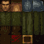
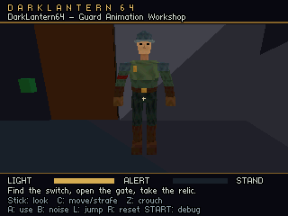
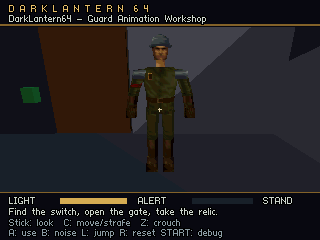
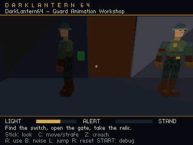
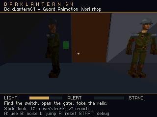

# Painted guard atlas and texture cost

This study replaces the shared guard's color-patch texture with a painted face, tunic front/back, steel, leather, crimson armband and brass details. The selected target is a **64 × 64 CI4 atlas with an authored 16-color palette**. It is used by the same shared guard resource in every level.

## What changed

The canonical artist source remains [art/guard.blend](../art/guard.blend). Its active material uses a packed, paintable high-resolution image; the exporter writes [guard-atlas-painted.png](../content/assets/guard/guard-atlas-painted.png). The [shared material](../content/assets/guard/pack.json) sets the 64 × 64 target, CI4 format and palette. The cooker creates the exact reduced image used by LightEngine and the N64. A separately named packed image in Blender provides a target-resolution preview; it does not replace or silently override the authoring image.

The image was generated with the built-in image generation tool. The [original generated source](../art/guard-atlas-painted-source.png) and [complete prompt](../art/guard-atlas-painted-prompt.txt) are retained. Its actual rectangle layout differs from the requested grid, so the saved UVs follow the generated image. Source artwork is 1254 × 1254; that is an authoring resolution, not the runtime texture size.

UVs now follow continuous body regions instead of assigning each polygon an isolated patch. The mesh still has **535 triangles, 20 bones and five unchanged animation clips**. Attribute vertices fall from **1,009 to 738** because adjacent faces can share UV coordinates. Expanded triangle positions, normals and bone assignments remain identical. This is a UV optimization, not a reduction of the guard's silhouette or animation detail.

## Memory

| Shared guard resource | Previous | Painted CI4 |
| --- | ---: | ---: |
| Texture dimensions | 32 × 32 | 64 × 64 |
| Texture pixels | 1,024 | 4,096 |
| Packed pixel bytes | 2,048 | 2,048 |
| Palette bytes in RAM | 0 | 32 |
| Pixels plus palette | 2,048 | 2,080 |
| Uncompressed SDK sprite, including header | 2,184 | 2,216 |
| TMEM working allocation | 2,048 | 4,096 |

The new image provides four times as many pixels for 32 additional shared resident bytes. Each additional guard using this material reuses the same image allocation. CI4 indices occupy TMEM's lower 2 KiB and palette lookup uses its upper half, so this target fills TMEM even though the source palette is small. It leaves no room for a simultaneous mip chain in the current whole-texture upload path.

The UV change also reduces shared geometry and per-instance rendering buffers. Actual memory and performance deltas are recorded with the measurements below; they must not be attributed solely to the texture format.

## Palette choice

Automatic median-cut quantization favored the atlas's large olive and brown regions and lost the steel colors. Maximum-coverage quantization preserved steel but flattened cloth and introduced unsuitable colors into leather. A 64 × 32 CI8 alternative preserved more colors at 2,560 bytes including its palette, but reduced the face to eight vertical texels.

The selected CI4 material uses an explicit palette to reserve colors for the different surfaces. Palette entries are `#RRGGBB` strings in the material's optional `texture.palette` array. The cooker snaps them to RGB5551 and maps the image to those colors. This remains deliberately coarse art; it is not equivalent to the original Thief guard's 128 × 256 indexed texture.

## Reproduce and edit

1. Open the saved `art/guard.blend`. Paint the active high-resolution image or adjust UVs. Use **Image > Save All Images** to persist/repack painted images, then save the Blender file. The exporter reads this saved source, not unsaved edits in an open Blender session.
2. Run `python tools/guard_assets.py` to export the saved source. The material's `dl64_texture_export_name` property selects the output filename; the original atlas remains separate.
3. Adjust the palette or target format in `content/assets/guard/pack.json` when needed. An explicit palette is optional for CI4/CI8 and is not valid for RGBA16.
4. In the project editor, use **Save + Cook** to refresh the shared material, then **Play level**. **Launch game** builds the normal bundled menu. No additional VS Code task is required.

Blender's separately packed target preview is a generated snapshot. **Save + Cook** refreshes the editor/game image, not that packed Blender snapshot.

The editor's Material panel displays the format, pixel/palette RAM bytes, row-aligned TMEM pixels and palette reservation. Linked resources retain their shared ownership; their source file controls changes across levels. See the [texture pipeline](texture-pipeline.md) for supported dimensions, palette validation and converter checks.

## Measurement method

The study preserves the original and updated source, art, ROMs, build manifests and exact Tiny3D dependency in separate directories under `build/guard-atlas-study/`. The original baseline is commit `d2b9d4d229d09816e89765ef6025710f7591ac3b`. Performance uses the existing ordinary-gameplay two-guard acceptance tool: normal animation, AI, lighting, audio and HUD, without capture freezes or profiling overlays. Fixed idle/walk images come from separate capture ROMs with matching content.

The baseline reproduced 1,800 fresh presentations in 1,800 VI intervals, zero repeats, 10.791729 ms average CPU work and 15.396032 ms maximum. This is Ares timing for the measured workload; original N64 and M64 measurements remain separate validation work.

## Measured result

The updated workshop **passes the strict 60 fps gate**, with 1,800 fresh presentations in 1,800 VI intervals and no repeated frames. The native measured refresh is about 59.826 Hz. Average frame work falls by **0.519 ms (4.81%)**. These are the combined texture, UV and resulting buffer/batch changes; this is not evidence that CI4 alone makes a guard faster.

| Two active, visible guards; ordinary gameplay | Previous | Painted guard |
| --- | ---: | ---: |
| Average frame work, excluding display wait | 10.792 ms | 10.273 ms |
| 95th-percentile work | 12.077 ms | 11.550 ms |
| 99th-percentile work | 13.801 ms | 13.240 ms |
| Maximum work | 15.396 ms | 14.821 ms |
| Frames above 16.667 ms work budget | 0 / 1,800 | 0 / 1,800 |
| Repeated VI presentations | 0 | 0 |
| Sampled peak heap | 1,007,984 B | 971,208 B |
| Shared character compiled geometry | 26,417 B | 20,184 B |
| Workshop RSP buffers | 156,977 B | 131,017 B |
| Workshop RSP draw batches | 40 | 32 |
| Workshop padded vertex loads | 2,388 | 1,892 |

The sampled heap saving is **36,776 bytes (35.9 KiB)**. Nested vertex-color upload time falls from 2.507 to 2.008 ms per frame, while animation sampling stays essentially unchanged at 1.106 versus 1.108 ms. This is consistent with fewer attribute vertices and smaller batch buffers; nested timings are already included in the frame total. All 30 ordinary material-log samples show one texture upload per sampled frame in both builds. That count is sampled, not a trace of every frame.

The same shared guard was also measured in Sponza, with unchanged authored geometry, lights and guard placements. Its before values come from preserved, revalidated earlier ordinary-gameplay runs; the workshop baseline above was freshly reproduced for this study.

| Sponza ordinary start | Before → after presented fps | Before → after average work |
| --- | ---: | ---: |
| Courtyard | 41.15 → 42.79 | 24.282 → 23.344 ms |
| Upper gallery | 59.83 → 59.83 | 12.250 → 11.504 ms |

The courtyard remains below 60 fps. The upper gallery has no repeated presentations, but still has 15 frames above the 16.667 ms work budget in each measurement, so it is not a strict work-budget pass. These tests characterize the current two-guard workloads; they do not establish a crowd or combat limit, and original N64/M64 validation remains pending.

Full counts, input/ROM hashes, environment matches, timing distributions and reproduction commands are in [the performance evidence](evidence/guard-atlas-study.json).

## Visual evidence

[Exact cooked 64 × 64 indexed atlas](images/guard-atlas-ci4.png) (palette expanded by an image viewer for display):

These images are unmodified 320 × 240 RDP framebuffers, captured before VI filtering with identical camera and pose settings. Capture ROMs are separate from the ordinary ROMs used for timing.

| Previous atlas | Painted CI4 atlas |
| --- | --- |
|  |  |
|  |  |

[Walking pose](images/guard-atlas-after-guard-walk.png) and [procedural head attention](images/guard-atlas-after-guard-attention.png) use the same painted resource. [Close-view provenance](evidence/guard-atlas-close-captures.json) records the unchanged authored views and source log hashes.

The face, shoulder steel, leather and tunic now have dedicated painted regions. At gameplay distance the face still occupies very few screen pixels, and its contrast changes with the actual level lighting. The high-resolution source is not a promise of that detail at 320 × 240. For authoring inspection only, [the source render](images/guard-painted-source-blender.png), [reduced CI4 render](images/guard-painted-ci4-blender.png) and [face render](images/guard-painted-face-blender.png) use neutral Blender lighting and nearest texture sampling; they are not N64 screenshots.

## Verification

The complete Python and portable C host checks passed. All twelve existing RGBA16 textures and their SDK sprite files remained byte-identical against the original cooker. Indexed texture checks cover palette persistence, row padding, transparency, exact native sprite indices/colors, size rejection and cache validation. Private editor checks verify CI4/CI8 save/cook/reopen, visible texture refresh and atomic rejection of invalid edits.

The normal five-level menu bundle builds and boots, and each level resolves the same painted guard material. It contains 32,768 packed texture bytes plus the single 32-byte palette across the bundle; [bundle evidence](evidence/guard-atlas-bundle.json) records its manifest and ROM hash.

The new UVs also exposed a desktop preview bug: collapsed UV regions have no tangent direction, and LightEngine's tangent generator produced non-finite values that its deformation upload correctly rejected. The project preview now supplies a finite orthonormal frame only where the tangent is undefined. Existing positions, normals, UVs and valid tangent frames remain exact; this albedo-only fix does not change the N64 ROM or engine source. Both focused C++ tests and all twelve actual character-editor checks pass, including scrubbing, blending, head attention, independent instances, stable vertex allocations and animation re-export. See [character editor evidence](evidence/guard-atlas-character-editor.json). The normal **Launch Editor** executable has been rebuilt. The [walking editor capture](images/guard-atlas-editor-walk-stride.png) shows the cooked atlas on the deforming mesh. LightEngine uses its desktop lighting and color pipeline, so matching cooked texels do not imply identical lit colors to the N64.

Saved Blender source roundtrips to the canonical export. Geometry identity and 425 key/half-key animation poses pass. A private paint edit survives image repacking, saving a private Blender file and exporting through the ordinary CLI in a fresh process. See [UV and source evidence](evidence/guard-atlas-uv.json), [cooker regression evidence](evidence/guard-atlas-cooker-regression.json) and [texture editor evidence](evidence/guard-atlas-texture-editor.json).
