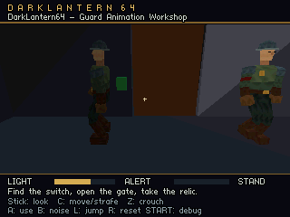

# Guard renderer architecture and performance evidence

The default Tiny3D backend moves guard vertex transforms, projection, clipping and triangle setup onto the N64's RSP. It keeps the authored mesh, animation clips, texture atlas, gameplay, lighting policy and HUD. Editor Play and the existing Launch game task use this backend. The CPU renderer remains available as a reference through `--renderer cpu`.

The current shared guard uses the [painted 64 × 64 CI4 atlas and continuous UV layout](guard-atlas-study.md). Its comparison results are recorded separately. The acceptance numbers and allocation counts below preserve the earlier palette-atlas revisions and their exact ROM hashes.

Before the painted-atlas revision, the two-guard workshop **passed the sustained 60 fps target in Ares**, presenting one new framebuffer per native NTSC video interval with normal gameplay and audio. The [complete acceptance report](evidence/guard-60fps.json) records **1,800 fresh presentations over 30.087 seconds, with zero repeated scans**. Ares's measured native rate was 59.82618 Hz; “60 fps” here means keeping every native refresh supplied.

| Steady measurement | Result |
| --- | ---: |
| Average CPU work | 10.792 ms |
| 95th / 99th percentile work | 12.077 / 13.801 ms |
| Maximum CPU work | 15.396 ms |
| Work samples exceeding 16.667 ms | 0 / 1,800 |
| Fresh framebuffers / VI scans | 1,800 / 1,800 |
| Average transforms / lighting / triangle submission | 3.534 / 5.467 / 0.310 ms |
| Average normal HUD | 0.056 ms |

Work includes audio, reporting and queue stalls, and excludes display-buffer waiting. The debug overlay is off; profiling continues in the background. Two posed guards and 1,190 candidate scene triangles were submitted in every measured frame. The patrol moves along its route while the sentry holds position. This quiet scene has no active attention overlays and does not establish crowded combat, worst-case audio or original N64/M64 performance. This recheck includes the shared-resource migration, integrated sleeve stripe, [perspective precision correction](depth-precision.md), [Sponza query/static-transform optimizations](sponza-study.md), and the [offline lighting loader](level-loading.md). The verified ROM SHA-256 is `0072e89963129d76379b82309c760a4f9a146e88d6319df107ee5d01c01bb7d1`.

The earlier [animation prototype measurement](evidence/guard-runtime.json) averaged **99.64 ms per frame** with the CPU reference renderer. That is a historical workflow/correctness measurement, not a controlled speedup denominator: the final authored camera was adjusted to frame the two guards. Short diagnostic runs and reciprocal CPU work time do not establish presentation throughput; the final result checks actual scanout changes separately.

## Workload and division of work

The initial [guard asset report](evidence/guard-compression.json) records 20 bones, 531 triangles, 997 attribute vertices, five clips and 8,820 bytes of compressed keys. That renderer change retained the 32 × 32 atlas and all 48 triangles spanning elbow/knee joints. No mesh simplification or animation-rate reduction was involved. The later [sleeve correction](evidence/guard-armband-fix.json) changed the mesh to 535 triangles and 1,009 vertices while retaining the rig and clips; the performance result above includes that correction. The subsequent [painted unwrap](guard-atlas-study.md) reduces attribute vertices to 738 while preserving those 535 triangles and animations. The integration measurements below retain their original asset revision.

| Per guard | Initial integration count | Meaning |
| --- | ---: | --- |
| Bone transforms | 20 | One sampled pose palette; vertices have one influence each |
| Source triangles | 531 | Original connectivity and triangle order retained |
| Source attribute vertices | 997 | Includes UV and normal seams |
| RSP batches | 15 | Each fits the selected microcode's 70-vertex cache |
| Submitted vertex loads | 1,002 | Includes pair padding and any batch duplication |
| Matrix/load groups | 35 | Bone matrix selections across those batches, not 35 bones |
| Distinct lighting normal/bone groups | 318 | UV seam copies share a color calculation |

The [batch builder](../src/render_batches.c) groups a batch's vertices by bone, loads each group under its matrix, then emits its triangles. Loads start on even indices and contain an even number of vertices because Tiny3D transfers packed vertex pairs. Flat meshes retain a separate `(source vertex, face)` identity so adjacent faces preserve different normals and colors. Batch and normal-group metadata are built once per shared mesh. The pinned RSP implementation and importer both specify **70 cache entries**; an older API comment saying 64 is stale. [Pinned RSP source](https://github.com/HailToDodongo/tiny3d/blob/ec557373e986b5e041cc102a7ff787eb07921937/src/t3d/rsp/rsp_tiny3d.S#L2), [pinned importer](https://github.com/HailToDodongo/tiny3d/blob/ec557373e986b5e041cc102a7ff787eb07921937/tools/gltf_importer/src/structs.h#L260)

| Processor | Work in this backend |
| --- | --- |
| CPU | Gameplay, AI, audio synthesis, animation sampling/blending and head adjustment; bounds/culling; per-bone instance/modelview matrices; existing world-light probes; directional vertex colors; command submission |
| RSP | Vertex matrix transforms, projection, clipping, triangle setup and production of RDP commands through Tiny3D |
| RDP | Depth testing, textured/shaded triangle rasterization, filtering, blending and HUD rectangles/text |
| VI | Reading the completed framebuffer for video output |

Tiny3D can also perform lighting, but this integration supplies CPU-computed vertex colors and disables its directional-light calculation. That preserves the game's existing light/occlusion behavior. Small dynamic flat props retain reference CPU deformation for lighting; this is not a claim that every remaining CPU geometry operation has disappeared. [Renderer implementation](../src/render_t3d.inc), [pinned Tiny3D API](https://github.com/HailToDodongo/tiny3d/blob/ec557373e986b5e041cc102a7ff787eb07921937/src/t3d/t3d.h)

## Connected joints without blended weights

A triangle can join already transformed vertices belonging to different bones. Loading the next bone's matrix does not transform the earlier cached vertices again. This is the technique discussed in Kaze's example and explicitly documented by Nintendo for joint construction. The guard's elbows and knees now use this actual matrix/load/cache sequence on the RSP. [Kaze, approximately 13:38–14:05](https://www.youtube.com/watch?v=xwls5SpNn1s&t=818s), [Nintendo's `gSPVertex` documentation](https://ultra64.ca/files/documentation/online-manuals/man/n64man/gsp/gSPVertex.html)

An isolated [Tiny3D proof ROM](../tools/tiny3d/README.md) loads two vertex pairs under separate matrices, then connects them into two triangles. Ares captures show both the original square and its deformed connected shape. A separate winding test produced 10,000 colored pixels with `CULL_BACK` and zero with `CULL_FRONT` for a known CPU-front triangle. Tiny3D internally swaps two triangle arguments before its assembly kernel, so inspecting the kernel's signed-area branch alone would give the wrong culling conclusion.

This avoids multiple weighted transforms per joint vertex. Matrix changes, vertex loads, cache padding and rasterization still cost time. It proves this guard's topology, not arbitrary skinning quality or crowd capacity.

## Lighting fidelity and repeated work

Each visible guard still takes **two body probes per frame**, at 0.65 m and 1.35 m above its actor position. Scalar scenes average the original visibility values. Night scenes average the existing surface-light RGB values. Normal grouping does not cache, remove or replace those world/occlusion queries.

For positive uniform-scale guards, rigid bone rotations preserve normal length. The CPU transforms the presentation-light direction into each bone's local space once, then shades each normal group using a dot product. In the original integration, 318 groups supplied RGB values to 997 source vertices and 1,002 packed entries. Nonuniform or reflected instance scales use the full transformed-and-normalized normal path. Two-sided materials retain independently shaded front/back colors. [Lighting helpers](../src/render_lighting.c), [matrix helpers](../src/render_transform.c)

The host checks compare 160,000 scalar/night normal pairs with the original formulas, matching the reference bytes. Another 51,200 grouped cases cover uniform, nonuniform and reflected scales; the measured scalar-front difference was zero, with assertions allowing at most one final color unit for floating-point reassociation. Transform checks compare 38,400 cases with the prior operations, including hinges, camera conventions and inverse-transpose normals. Their tested packed/fixed transform error was at most approximately 4.46 mm; this is a fixture measurement, not a universal scene-space error bound. [Lighting tests](../tests/test_render_lighting.c), [transform tests](../tests/test_render_transform.c)

An additional [cooked-guard check](evidence/guard-rsp-geometry.json) covered 84,745 posed vertices across five clips, 17 phases and attention/yaw variations. It retained every source triangle, including all 48 mixed-bone triangles. Bulk lighting changed zero final RGB bytes against the scalar reference; the largest packed/fixed view-position difference in this fixture was approximately 1.24 mm.

## Visual and gameplay regression evidence

Separate [reviewed workshop captures](evidence/guard-60fps-visibility.json) show both guards with their original textured materials and connected limbs. The timing run uses ordinary live gameplay; these frozen-pose captures are visual evidence only.



The [courtyard comparison](evidence/rsp-renderer-parity.json) covers seven matching CPU/RSP views, including colored street lighting, the large floor, door states, loot and highlight phases. Geometry, materials, lighting and fog formulas are retained. Output is not pixel-identical: packed positions, RGBA8 colors and hardware interpolation differ from the CPU triangle path. Mean absolute channel differences in the scene viewport ranged from 3.11 to 4.88 on a 0–255 scale. These are image-comparison measurements, not a perceptual quality guarantee. The backend explicitly keeps antialiasing and dithering disabled for this comparison.

[Gameplay regressions](evidence/guard-rsp-regressions.json) passed the 4 MiB startup rejection, an uncaught completed heist with active audio, and 66 transitions covering four levels and 11 starts. All 33 resume checks preserved state, and per-start heaps stabilized across repeated switches. The workshop used 1,006,248 heap bytes at the measured start; the largest tested level used 1,191,040 bytes. Those heap figures exclude static allocations and cannot substitute for a complete RAM budget.

## Command and framebuffer lifetimes

Each model records its geometry command sequence once. Segment-relative addresses let that block reference the currently selected vertex and matrix storage without rebuilding or copying the command list each frame. Immutable batch metadata is shared by instances of the same mesh. The CPU still writes changing palettes/colors and writes back their data-cache lines; this is not zero memory traffic.

There are **three sets of vertex, matrix and viewport data**. Before reusing a set, the CPU waits for that set's RSP completion syncpoint. Each batch ends with `t3d_tri_sync()` before its vertex slots can be overwritten. The final geometry syncpoint is sufficient for these RSP input buffers because the RDP subsequently reads generated RDP commands, not the original model vertex/palette arrays. Scene teardown performs a full queued graphics wait before freeing model blocks, textures, HUD blocks and other caches.

For the original 997-vertex one-sided guard, packed vertices consumed 16,032 bytes per set; three sets totaled 48,096 bytes per actor. Twenty fixed matrices occupied 1,280 bytes per set, or 3,840 bytes per actor. Thus two guards used **103,872 bytes** for these buffered vertices and palettes, excluding shared metadata, command blocks, viewports, textures, legacy caches, alignment and allocator overhead. The [painted-atlas comparison](guard-atlas-study.md) records the later buffer reduction. Two-sided models need a second color/vertex stream. The `rsp_ready data_bytes` log is an allocation subtotal, not total renderer RAM.

The T3D path also has three 320 × 240 RGBA5551 display buffers: one can scan out while another is queued and the CPU prepares the next frame. The third display buffer adds **153,600 bytes** compared with the CPU path's two. Display-buffer ownership is managed separately by libdragon; the RSP data syncpoint does not make a framebuffer safe to overwrite. Buffering permits overlap but cannot make a consistently slow RSP/RDP finish within a video interval.

HUD text is recorded at scene preparation into persistent RSPQ blocks. Frame rendering selects the correct prompt/stance composite while preserving text, position, order and result messages. Glyph commands reference the persistent font resources, not the temporary layout paragraph or source strings. Teardown frees composites before the child blocks they reference. The [HUD host test](../tests/test_hud_cache.c), included in `tools/build.py --test`, checks 400 replays plus terminal messages, title escaping/truncation and scene lifetimes.

## Coordinate and fog compatibility

The renderer forms camera-relative modelview matrices before conversion to Tiny3D's signed 16.16 format. GPU space uses 64 units per metre. Bind positions initially use 1,024 packed units per metre, reduced when necessary to fit signed 16-bit components. Camera subtraction before rotation preserves local precision in worlds positioned far from the origin. [Transform contract](../src/render_transform.h), [pinned fixed-matrix definition](https://github.com/HailToDodongo/tiny3d/blob/ec557373e986b5e041cc102a7ff787eb07921937/src/t3d/t3dmath.h)

These formats still have limits. Matrix components are checked before conversion; at 64 GPU units per metre, the translation component's signed 16-bit integer range corresponds to approximately ±512 m relative to the camera. This is a component-format limit, not a promised map-size limit. Tiny3D UVs are signed 10.5 texel coordinates, approximately −1,024 through +1,023.96875 texels. The packer rebases an entire batch by whole texture repeats when necessary, retaining interpolation and wrapping. It rejects nonfinite coordinates and batches whose span cannot fit before narrowing them. Large geometry may need splitting into smaller meshes or batches. [UV packing tests](../tests/test_render_texture_packing.c) cover range failures, repeat preservation and padding; the courtyard capture comparison covers its large floor and textured props.

The scalar reference renderer mixes fog into vertex RGB **before texture modulation**, over eye depths 8–50 m with an 80% cap. Night scenes blend their configured fog color **after texture shading** using vertex alpha. Simply enabling Tiny3D's standard fog calculation would change that behavior and its depth ramp. The backend therefore evaluates the same eye-depth factor on the CPU only for models whose bounds intersect the fog range. Close guards skip that per-vertex position work; distant animated guards can require it. This work remains visible in profiling.

There is a remaining clipping difference: the CPU reference evaluates fog at newly clipped vertices, while this backend supplies fogged source colors/alpha before RSP clipping. Interpolating a product or a clamped fog factor does not generally equal recomputing it at a clipped vertex. Large fogged triangles crossing a frustum plane can therefore differ by more than color quantization. The current courtyard comparisons cover the tested views, not universal fog parity. Exact compatibility would require evaluation after clipping in the RSP or selective compatibility clipping; the proposed RSP fog effect below should include these cases.

## Dependency and queue constraints

The dependency is pinned to Tiny3D [`ec557373e986b5e041cc102a7ff787eb07921937`](https://github.com/HailToDodongo/tiny3d/tree/ec557373e986b5e041cc102a7ff787eb07921937), a compatibility revision that builds against the installed libdragon SDK. [dependencies.json](../dependencies.json) is authoritative. `python tools/build_tiny3d.py --fetch` explicitly acquires and builds it locally; `python tools/setup_editor.py --tiny3d` adds that step to editor setup. Ordinary ROM builds do not fetch dependencies. The helper does not install headers/libraries or modify the SDK. Build manifests fingerprint the renderer, library, dependency revision and SDK inputs. The SDK itself is not yet an automatically provisioned source pin.

The dependency cache fingerprints the SDK/toolchain contents and relevant flags separately from make's timestamps. Changes force rebuilding disposable objects and generated RSP metadata. A clean rebuild with the measured SDK reproduced the original library byte for byte (`f4ac41f4d9ada8e80bdca3d68a7484e57ca02cdf8b6b01fb43024f940327d819`); its next build remained incremental. Host tests cover SDK switches, same-timestamp compiler/header replacements, incomplete caches and failed builds.

Source inspection and disassembly of the installed `libdragon.a` establish the following queues:

| Queue | Capacity | Consequence |
| --- | ---: | --- |
| CPU low-priority RSP command queue | 2 × 2 KiB | CPU submission can wait when it catches the RSP |
| CPU high-priority queue | 2 × 512 B | Reserved for urgent work; not a general graphics acceleration option |
| RDP dynamic command buffers | 2 × 64 KiB | Already 128 KiB total; these are not a 4 KiB buffer |

The [inspected libdragon fork](https://github.com/hughes/libdragon/tree/7a82f8e50e82ad4601d530801630d8bd0d2fcd00) matches the relevant installed headers. Queue sizes are defined in [RSPQ constants](https://github.com/hughes/libdragon/blob/7a82f8e50e82ad4601d530801630d8bd0d2fcd00/include/rspq_constants.h) and [RDPQ constants](https://github.com/hughes/libdragon/blob/7a82f8e50e82ad4601d530801630d8bd0d2fcd00/include/rdpq_constants.h). [RSPQ buffer reuse](https://github.com/hughes/libdragon/blob/7a82f8e50e82ad4601d530801630d8bd0d2fcd00/src/rspq/rspq.c#L920) waits for RSP completion; [RDP command submission](https://github.com/hughes/libdragon/blob/7a82f8e50e82ad4601d530801630d8bd0d2fcd00/include/rsp_queue.inc#L750) can itself wait for the RDP DMA queue to drain. A delay charged to HUD submission can therefore be backpressure from preceding geometry.

The initial 60 fps integration needed no Tiny3D fork. The subsequent depth regression fix applies a [reviewed project patch](../tools/tiny3d/patches/README.md) to a disposable copy of this pin, leaving the source checkout and SDK unchanged. It refines the RSP reciprocal and viewport precision, preserving the existing cache/lighting/fog contract. The production library hash is `df33d2e57efdd0476d6a533d225cc1c1576f8645121d39a8620696d9f109281f`. Patch hashes, staged source contents and SDK identity all participate in build provenance. Its native RSP point-light handler is excluded to fit instruction memory; that API fails explicitly while our CPU light probes remain supported.

Two further changes remain candidates:

- **An RSP vertex effect for RGB fog**, preserving the scalar path's order and 80% cap, could remove distant animated-vertex depth calculations. It needs microcode timing, register-space, precision and visual-parity evidence.
- **Larger CPU low-priority queues in libdragon**, if measured submission bursts justify them. Two 8 KiB buffers would add 12 KiB RAM. No public size-setting API exists; a staged replacement of the matching C queue object appears feasible without a global SDK installation, but requires separate link/ABI and runtime validation. Enlarging these queues cannot improve sustained RDP throughput and may only move the wait. Changing the RDP buffer size would also require matching microcode changes; a CPU allocation patch alone is insufficient.

## Reproducing acceptance

Use the existing developer harness rather than adding per-feature editor tasks:

```powershell
python tools/verify_guard_performance.py --renderer t3d --visibility-report docs/evidence/guard-60fps-visibility.json
```

The visibility report must refer to separately inspected, source-matched framebuffer captures of the authored `two-guards` preset. The harness verifies the ordinary ROM manifest, excludes three warmup windows, and requires at least 30 seconds of complete steady measurements. It checks every measured CPU work frame against 16.667 ms, actual VI-origin changes for repeated scans, both animated guard submissions, active audio/gameplay, and independent patrol/sentry behavior. Capture dumps, autoplay and the debug overlay must be disabled in the measured ROM. Submission counts prove work was issued; the separate images prove both guards actually appear.

CPU work time excludes display-buffer waiting, so it cannot alone establish presentation throughput. Nested lighting/animation timings exclude audio interrupt time and must not be added again to their parent slots. Ares measurements describe its emulated N64 CPU/VI behavior; they do not establish original N64/M64 timings or the host monitor's presentation cadence. The [performance report](evidence/guard-60fps.json), [visibility review](evidence/guard-60fps-visibility.json), [courtyard comparison](evidence/rsp-renderer-parity.json) and [gameplay regressions](evidence/guard-rsp-regressions.json) preserve the measured scope and provenance.
