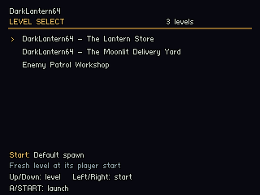

# Level select and test starts

A bundle puts several saved levels in one N64 ROM. It can open a level-select screen or boot directly into a chosen level and named test start. The included bundle contains **The Lantern Store**, **Moonlit Delivery Yard**, and **Enemy Patrol Workshop**.



## Build and launch

In VS Code, run **DarkLantern64: Build + Play level select**. Save + Cook each open workshop first; the bundle reads saved source files. Existing per-level Build + Play tasks continue to launch that level directly.

```powershell
# All three levels, starting at the selector
python tools/build.py --bundle content/level_bundle.json --run

# Same bundle, immediately enter the yard
python tools/build.py --bundle content/level_bundle.json --start-level moonlit-yard --run

# Same bundle, immediately enter a particular testing state
python tools/build.py --bundle content/level_bundle.json --start-level enemy-workshop --start-preset store-door-open --run

# A standalone level ROM at a testing state
python tools/build.py --level content/enemy_patrols.json --start-preset scout-observation --run
```

The PowerShell wrapper also accepts `-Bundle`, `-Level`, `-StartLevel`, and `-StartPreset`. For example, `./build.ps1 -Bundle content/level_bundle.json -Run` opens the selector. **Build + Play test start** offers a VS Code picker for the two example starts in Enemy Patrol Workshop.

Build output names include the bundle, selected level and preset. This keeps a menu ROM and a directly launched testing ROM separate. The build report prints the actual ROM path. The existing no-argument build remains a direct launch into The Lantern Store.

## Controller controls

| In the selector | Control |
| --- | --- |
| Choose level | D-pad, C-Up/Down, or stick up/down |
| Choose that level's start | D-pad, C-Left/Right, or stick left/right |
| Launch a fresh run | A or Start |
| Resume the paused run, when available | B |

During play, **hold Z and press Start** to return to the selector. Gameplay pauses. **B resumes the same run**, even if you browsed to a different menu entry. **A/Start launches a fresh run** of the selected entry. **R restarts the current level at its selected test start.** Start on its own still toggles the profiler overlay.

With the provided keyboard mapping, arrows select menu entries, **E** or **Tab** launches, and **N** resumes. **Z + Tab** opens the selector during play. In a standalone level ROM, this menu still provides that level's default spawn and any test starts.

## Define a bundle

Edit [content/level_bundle.json](../content/level_bundle.json). Each entry assigns a stable ID to a source JSON directly inside `content/`:

```json
{
  "version": 1,
  "title": "DarkLantern64",
  "levels": [
    {"id": "lantern-store", "source": "first_room.json"},
    {"id": "moonlit-yard", "source": "moonlit_courtyard.json"},
    {"id": "enemy-workshop", "source": "enemy_patrols.json"}
  ]
}
```

The selector uses each level's authored title and the manifest's order. A bundle supports 1–8 unique level files. IDs and paths are validated; missing files, duplicate entries, unknown test-start IDs and incompatible build flags fail before ROM publication. `--start-level` uses the bundle entry ID, while `--level` uses a source path. A bundle's `--start-preset` requires `--start-level`.

## Author a named testing state

A level can contain up to 16 entries in its optional `test_starts` array. **Default spawn** is always available and uses the ordinary player-start entity. A named start specifies the player's feet position, yaw/pitch in degrees, initial stance and door state:

```json
"test_starts": [
  {
    "id": "store-door-open",
    "label": "Inside store / gate open",
    "position": [2.5, 0, 0],
    "yaw": 90,
    "pitch": 0,
    "door_open": true,
    "crouched": false
  }
]
```

Author these in the level JSON for now. Save and close its editor before making external edits, then validate and reopen. Position uses metres with Y up. `yaw` and `pitch` are required; `label` defaults to the ID, while `door_open` and `crouched` default to false. Pitch is limited to the gameplay camera's ±1.35 radians (about ±77.35 degrees). The compiler checks supporting floors and headroom using the preset's door state and stance.

Each launch resets enemies, awareness, patrol progress, objective status, sounds and elapsed time, then applies the named start. Enemy Patrol Workshop includes **store-door-open** for gate/interior testing and **scout-observation** for crouched observation of the workroom patrol. These are authored starting conditions; restoring arbitrary enemy histories, inventory and complete saved games remains future work.

## Runtime and memory

Each included level compiles into its own C translation unit, preventing generated symbol collisions. Texture sprites from all entries are packaged into one DragonFS, deduplicated by their validated content paths. The filesystem initializes for the entire bundle, so an untextured first level can later switch to a textured one.

Only the active level has loaded texture sprites and lighting caches. Fresh launches wait for outstanding graphics, release those allocations and rebuild them for the new level. The game and renderer reuse their bounded state and working buffers. Resume keeps the existing level's resources and state. Profiler windows restart after loads/resumes so those pauses do not appear as gameplay cost.

**Geometry and immutable level definitions for the whole bundle currently stay resident.** The existing 3 MiB startup-image guard still applies, allowing the 4 MiB machine to reach the Expansion Pak error screen. Build reports include aggregate geometry bytes, maximum active-level texture bytes and the complete static image size. These figures exclude other heap allocations and do not establish a maximum mission size. Streamed level data is the next step for larger packs; the first format targets small testing bundles.

## Verification

`python tools/build.py --test` covers manifest validation, texture union/deduplication, isolated generated C units, presets, launcher navigation and reset behavior, plus existing gameplay checks. `python tools/smoke_bundle.py` uses private Ares settings and owned emulator instances to check:

- An ordinary menu renders without starting a level, and the 4 MiB startup gate works.
- Every bundled default/preset launches, resumes and restarts across three cycles.
- Repeated texture/cache swaps reach a stable heap size for the same start.
- Bundle and standalone builds can bypass the menu into a named start.

It saves hashes, logs, per-start heap samples and the actual N64 menu framebuffer under `build/bundle-smoke.json`. **DarkLantern64: Verify level switching** runs the same check from VS Code. The diagnostic menu script is compiled only with `--menu-test`; normal ROMs use controller input. Existing capture, mission replay and scale diagnostics remain standalone level builds. Original N64 and M64 checks are still pending.

The [2026-09-05 verification record](level-select-results.json) passed 85 Python tests, 26 gameplay groups, launcher/profiler/culling checks, and the original Ares mission replay. The bundled diagnostic exercised 30 fresh starts/restarts and 15 resumes. Heap usage after preparation was stable across all repetitions: 614,120 bytes for the store/workshop and 668,760 bytes for the textured yard. These heap values exclude the static image, stacks and other non-heap memory. The ordinary three-level ROM is 327,680 bytes; its static image is 572,592 bytes, including 24,156 bytes of compiled geometry arrays.
