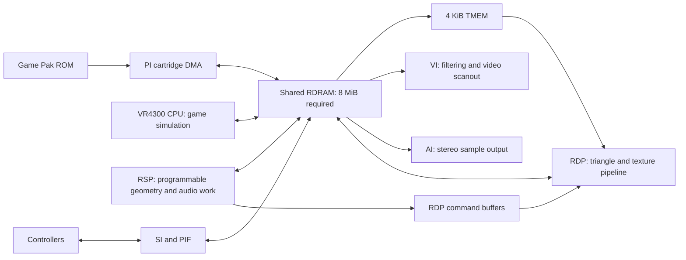

# Nintendo 64 hardware guide for DarkLantern64

Researched 2026-09-05. This guide describes original N64 hardware and proposes ways to use it for our [fully 3D game](decisions/0002-full-3d-world.md). **Hardware facts, calculated examples, and proposed game budgets are different things.** None of the performance figures below is a measurement of DarkLantern64. Our [8 MiB requirement](decisions/0001-memory-baseline.md) is accepted; detailed frame, geometry, lighting, and asset budgets remain to be measured.

Nintendo's original programming manuals are primary sources, accessed through preservation mirrors. Their proprietary SDK examples explain the hardware; our implementation uses libdragon. Current libdragon and Tiny3D documentation describes software capabilities that may require a different revision from our installed SDK.

## Answers to the design questions

| Question | Answer and consequence for this game |
| --- | --- |
| Can the world be fully 3D and freely arranged? | Yes. Indexed meshes, perspective, arbitrary transforms, depth testing, bridges, rooms above rooms, and open landscapes fit the hardware model. A tile grid is not a hardware requirement. |
| Does N64 have dedicated graphics hardware? | Yes: the programmable RSP handles suitable geometry work, while the RDP rasterizes and textures triangles, blends colors, and handles depth and coverage. The VI processes and scans out the resulting image. |
| Does it have anti-aliasing? | Yes. RDP edge coverage and VI filtering cooperate. This differs from modern MSAA and must be evaluated alongside sharpness, texture filtering, and output hardware. |
| Can we use real-time vertex lighting? | Yes. Lighting can run on the CPU or in RSP microcode; the RDP interpolates the resulting vertex colors. An RSP geometry backend is the stronger long-term candidate. |
| Can lights move, flicker, or switch off? | Yes. Limit the affected vertices and lights per batch, and keep rendering and guard perception connected to the same authored light state. Dynamic shadows are a separate, more expensive feature. |
| Can we walk seamlessly from a room into a courtyard? | Yes. Keep a continuous world and make visibility, asset residency, and lighting transitions work across the doorway. A small mission can be entirely resident; a larger mission needs planned streaming. |
| Does the Expansion Pak solve performance limits? | It doubles addressable RDRAM to 8 MiB. It does not double processor speed, TMEM, or memory-interface bandwidth. Spend it on useful residency before increasing resolution. |

The sections below establish the evidence and practical limits behind these answers.

## 1. The machine is several cooperating processors



This is a logical data-flow diagram, not a circuit or timing diagram. Command buffers also occupy RDRAM. The RCP contains the RSP, RDP, and interfaces; it is not a third independent geometry processor. CPU, RSP, RDP, and I/O can operate concurrently, but share access to main memory. [Nintendo: RCP architecture](https://ultra64.ca/files/documentation/online-manuals/man-v5-1/pro-man/pro03/03-02.htm)

| Component | Hardware role | What we should assign to it |
| --- | --- | --- |
| VR4300 CPU | General-purpose MIPS processor, integer execution and floating-point unit. | Gameplay, AI decisions, visibility selection, collision, scene management, task submission. |
| RSP | Programmable scalar/vector coprocessor with very small local code and data memories. | Batched transforms, clipping/lighting and other work supported by the selected microcode; audio processing shares its time. |
| RDP | Fixed-function rasterizer, texture sampling/filtering, color combiner, blending, depth and edge-coverage processing. | Textured and shaded triangles, depth occlusion, fog/blend effects, fast clears. It does not calculate world-space light influence itself. |
| VI | Reads the framebuffer, filters/scales it, and supplies video output. | Final presentation, including the silhouette stage of N64 anti-aliasing. |
| AI | Transfers prepared samples from RDRAM for stereo output. | Reliable playback; sound synthesis, mixing and spatial attenuation still require software work. |
| PI | Cartridge/peripheral transfer interface and DMA. | Move ROM assets into RDRAM while other useful work proceeds. |
| SI / PIF | Controller communication path and peripheral interface. | Asynchronous input polling and accessory communication. |

The RDP and I/O roles come from [Nintendo's hardware description](https://ultra64.ca/files/documentation/online-manuals/man-v5-1/pro-man/pro03/03-04.htm). The distinction matters: “hardware audio” does not mean an independent unlimited sound mixer, and “hardware rendering” does not mean free transforms, lighting, or memory traffic.

### Clocks and usable work

The CPU runs at **93.75 MHz**, the RCP at **62.5 MHz**. These are clock figures, not game throughput. [Libdragon: system clock constants](https://raw.githubusercontent.com/DragonMinded/libdragon/trunk/include/n64sys.h)

Calculated nominal budgets:

| Render cadence | Time per frame | CPU clock cycles per frame | RSP clock cycles per frame |
| --- | ---: | ---: | ---: |
| 60 fps | 16.67 ms | 1,562,500 | about 1,041,667 |
| 30 fps | 33.33 ms | 3,125,000 | about 2,083,333 |
| 50 fps | 20.00 ms | 1,875,000 | 1,250,000 |
| 25 fps | 40.00 ms | 3,750,000 | 2,500,000 |

These figures divide clock frequency by nominal frame rate. Actual regional video timing must be used in the runtime. Cycles are not instructions or floating-point operations: dependencies, cache misses, branches, divisions, DMA waits, and task management all consume time. CPU and RSP budgets cannot simply be added together as if they were one faster CPU. A frame must meet every relevant processor and presentation deadline.

**Proposed starting target:** measure a 320×240, 30 fps NTSC encounter first; choose the PAL presentation policy explicitly. Keep simulation tied to elapsed time rather than assuming one update always represents 1/60 second. Frame targets remain proposals until representative content and audio run on hardware.

### CPU caches and data design

The CPU has **16 KiB instruction cache**, **8 KiB write-back data cache**, and a 32-entry TLB. Its 64-bit execution capability does not imply that pointers, entities, or ordinary counters should occupy 64 bits. Nintendo's normal software model used 32-bit addressing. [Nintendo: CPU](https://ultra64.ca/files/documentation/online-manuals/man-v5-1/pro-man/pro03/03-05.htm)

For DarkLantern64, favor compact arrays, bounded working sets, and sequential iteration. A rich editor object database should compile into compact runtime records, not a maze of heap objects and strings. Use persistent authoring IDs in tooling and compact indices at runtime. Batch perception work by nearby actors and lights. Cache reusable transforms; avoid calculating trigonometry, square roots, or visibility queries for data that has not changed.

The CPU cache is **not automatically coherent with DMA or the RSP/RDP**. Buffers need the correct cache writeback/invalidation and alignment at ownership changes. A stale cached command list can produce a graphics failure even when its CPU-side values look correct. Keep unrelated data out of the same DMA cache lines and use the SDK's supported helpers. Nintendo documents a 16-byte CPU data-cache line and the specific hazards of DMA overwriting cached data. [Nintendo: cache and DMA](https://ultra64.ca/files/documentation/online-manuals/man-v5-1/pro-man/pro03/03-06.htm)

### RSP advantages and limits

The RSP has **4 KiB instruction memory and 4 KiB data memory**, a scalar unit, and a vector unit operating on eight 16-bit elements. It exchanges larger datasets with RDRAM using DMA. This is a small programmable signal processor, not a modern general-purpose GPU with large caches. [Nintendo: RSP](https://ultra64.ca/files/documentation/online-manuals/man/pro-man/pro03/03-03.html)

Its advantage is doing carefully batched numerical work while the CPU handles gameplay. Its limitation is that code, working data, transfers, and scheduling must fit a very small local workspace. Loading more vertices into an authoring scene does not create a larger hardware vertex cache. Batch size and vertex reuse depend on the chosen microcode.

Libdragon's RSP command queue lets compatible microcode libraries share the RSP and queues RDP work through memory buffers. That gives us a supported route for geometry and audio to coexist. It does not give each library a dedicated processor. Avoid waiting after every object; submit useful batches and synchronize when ownership or results require it. [Libdragon: RSP queue](https://libdragon.dev/ref/rspq_8h.html)

## 2. Memory capacity and bandwidth are separate budgets

### What fits in 8 MiB

Our total CPU-addressable RDRAM is **8,388,608 bytes**, including the expansion memory. Framebuffers, depth, executable code, static data, stacks, game state, geometry, collision, textures, audio, command queues, decompression scratch, and loading overlap all come from that pool. There is no separate multi-megabyte VRAM allowance. See the [memory decision](decisions/0001-memory-baseline.md) and [Nintendo's shared-memory description](https://ultra64.ca/files/documentation/online-manuals/man-v5-1/pro-man/pro03/03-06.htm).

RDRAM has extra bits used by graphics metadata. They explain some physical-chip capacity figures that are larger than 4/8 MiB, but are not additional general-purpose heap space. Do not budget “9 MiB” for an Expansion Pak system. Nintendo also explicitly distinguishes sequential peak transfer from slower random access. [Nintendo: RDRAM organization](https://ultra64.ca/files/documentation/online-manuals/man/kantan/step1/2-4.html)

Calculated framebuffer costs below use tightly packed surfaces, a **16-bit depth buffer**, and no extra render targets. They exclude padding, allocator overhead, and all non-buffer memory.

| Resolution / color depth | One color buffer | Two color buffers + depth | Three color buffers + depth |
| --- | ---: | ---: | ---: |
| 320×240 / 16-bit | 150 KiB | 450 KiB | 600 KiB |
| 320×240 / 32-bit | 300 KiB | 750 KiB | 1,050 KiB |
| 640×480 / 16-bit | 600 KiB | 1,800 KiB | 2,400 KiB |
| 640×480 / 32-bit | 1,200 KiB | 3,000 KiB | 4,200 KiB |

Formula: color bytes = width × height × bytes per color pixel; total = color bytes × buffer count + width × height × 2. At 320×240 with three 16-bit color buffers and depth, 600 KiB is about **7.3% of 8 MiB**. The final table entry consumes over half the entire machine before a single model or sound is loaded.

Libdragon exposes 16/32-bit color surfaces and distinguishes low-resolution progressive modes from 480-line interlaced modes. A 640×480 interlaced output should not be described as 640×480 progressive at 60 complete frames per second. Triple buffering can reduce producer/consumer stalls but costs memory and may increase input latency depending on scheduling. [Libdragon: display modes and buffers](https://libdragon.dev/ref/display_8h.html)

**Recommendation:** use 16-bit color initially, reserve explicit loading headroom, and spend expanded memory on nearby content, useful detail, and audio before raising output resolution. Doubling width and height quadruples the pixels to store and render. Additional memory capacity does not make those pixels inexpensive.

### Why the headline bandwidth is misleading

The nominal 250 MHz RDRAM interface makes 500 million 9-bit transfers per second: **500 MB/s of eight-bit payload**, plus metadata bits. Counting all nine bits produces 562.5 MB/s of raw bit-equivalent traffic; that is not 562.5 MB/s available to the CPU. These are decimal MB/s and a bus ceiling, not sustainable application measurements. [Nintendo: RDRAM transfer specification](https://ultra64.ca/files/documentation/online-manuals/man-v5-1/pro-man/pro03/03-07.htm)

Actual throughput depends on access size, locality, read/write changes, memory latency, arbitration, and simultaneous users. The CPU, RSP, texture uploads, color/depth processing, video scanout, audio, and cartridge DMA compete for memory service. An 8 MiB build can be bandwidth-bound while much of its memory remains unallocated.

Two calculated illustrations, **not a bus simulation**:

- Reading a 320×240 16-bit image once per nominal 60 Hz refresh is 9.216 MB/s of pixel payload. VI filtering and actual transfer behavior can require more traffic.
- Clearing a 16-bit color buffer and 16-bit depth buffer at 320×240, 30 times per second, writes another 9.216 MB/s of payload. Drawing has not yet begun.

Texturing adds uploads; depth testing adds reads and conditional writes; blending may read the existing color. Drawing several layers over the same screen area repeats work. Small random CPU reads and many short transfers may achieve a fraction of the bus ceiling. Thus memory-resident does not mean free to access, and a low triangle count does not guarantee a cheap frame.

We should measure CPU memory-heavy loops, RSP/geometry throughput, RDP time, and cartridge transfers under realistic concurrent load. Do not turn an isolated `memcpy` or full-screen fill benchmark into an engine-wide bandwidth promise.

## 3. RDP image quality: use the hardware deliberately

The RDP provides perspective-correct texture sampling, interpolated vertex color, texture/color combination, depth testing, blending, fog-related operations, and coverage processing. These are specialized operations rather than a programmable fragment shader. The CPU or RSP supplies prepared triangle data; the RDP works in screen space. [Libdragon: triangle attributes and modes](https://libdragon.dev/ref/rdpq__tri_8h.html)

### Anti-aliasing and the final image

N64 anti-aliasing tracks how polygon edges cover a pixel. The RDP handles internal-edge behavior and stores information that lets the VI filter external silhouettes during scanout. It does **not** store eight independent full color/depth samples like a modern 8× MSAA target. Coverage, blending, and draw order interact. [Nintendo: antialiasing](https://ultra64.ca/files/documentation/online-manuals/man/pro-man/pro15/15-02.html)

With libdragon, enabling the RDP antialias mode and choosing a compatible VI/display filter are separate steps. `rdpq_set_mode_standard()` starts without AA. Turning on a VI filter alone is not evidence that geometry AA is active. [Libdragon: antialias modes](https://libdragon.dev/ref/rdpq__mode_8h.html)

For a dark stealth game, compare three presentations using identical camera motion: filtering disabled, standard coverage AA, and AA with dedithering. Evaluate silhouettes, small lanterns, texture shimmer, dark gradients, HUD legibility, and motion. A sharper still image can shimmer more; aggressive smoothing can obscure gameplay cues. Test the original video path and M64 output separately. Output scaling cannot add missing mesh detail or repair inconsistent lighting.

16-bit RGB color gives five stored bits per color channel. Dithering distributes quantization error; VI dedithering can soften its pattern. It does not make a 16-bit framebuffer identical to a true 32-bit one. Our art should retain readable value differences in shadow and avoid depending on nearly-black gradients that collapse on some displays. The SDK exposes dithering and video filter choices; choose them as a coordinated art/presentation policy. [Libdragon: display filter definitions](https://libdragon.dev/ref/display_8h_source.html)

### Texture memory is a working cache, not an asset library

The RDP samples textures from **4 KiB TMEM**. Larger source images require subdivision/uploads. Textures, mip levels, palettes, alignment, and format-specific bank layouts compete for this working space.

Some representative single-texture layouts, before other textures or mip levels:

| Format | Example dimensions | Texture data | Important limit |
| --- | --- | ---: | --- |
| RGBA16 | 32×32 | 2 KiB | Leaves some space for other data or mip levels. |
| RGBA16 | 64×32 | 4 KiB | Fills TMEM; no room for another resident texture. |
| RGBA32 | 32×32 | 4 KiB | Uses the format's split-bank layout. |
| I8 / IA8 | 64×64 | 4 KiB | Useful intensity/alpha representations when full independent RGB is unnecessary. |
| CI4 | 64×64 | 2 KiB of indices | CI indices occupy lower TMEM; palettes use upper TMEM. |
| CI8 | 64×32 | 2 KiB of indices | A 256-entry palette occupies upper TMEM through replicated storage. |

A CI8 palette's 512 source bytes occupy 2 KiB in TMEM. Smaller palettes do not expand the CI index area. Eight tile descriptors describe sampling layouts, not eight separate memories. [Nintendo: TMEM organization and capacities](https://ultra64.ca/files/documentation/online-manuals/man-v5-1/pro-man/pro13/13-08.htm)

**Material policy to prototype:** reusable small textures, controlled palettes, intensity textures tinted through the combiner where appropriate, and batches that reuse an upload. A compiler must validate the simultaneous TMEM layout, including palette replication, row padding, format constraints, and mip levels. Large desktop atlases should be cooked into useful target pages rather than uploaded as if this were a modern GPU.

### Texture filtering and mipmaps

The usual N64 mode called “bilinear” performs **three-point triangular interpolation**, selecting three texels from a 2×2 neighborhood. It differs from conventional four-texel bilinear interpolation, which helps explain diagonal patterns in some texture transitions. Preview this behavior during material authoring. [Nintendo: texture sampling/filtering](https://ultra64.ca/files/documentation/online-manuals/man-v5-1/pro-man/pro14/14-01.htm)

Mipmapping is supported. The RDP can select texture detail from screen-space changes in texture coordinates and blend adjacent levels; that interpolation uses two-cycle rendering and consumes combiner/TMEM resources. Mipmaps can improve moving floors and distant masonry substantially, but the complete working set must fit. A full square mip chain approaches one-third more texels than its base level before alignment. A base texture that fills TMEM cannot retain that whole chain simultaneously. [Nintendo: LOD and mipmapping](https://ultra64.ca/files/documentation/online-manuals/man/pro-man/pro13/13-07.html)

Use texture scale and geometric detail to suit the viewing distance. Avoid solving every blurry surface by enlarging the texture: close-view detail, repeatable patterns, palette design, filtering, and light contrast all contribute to readability.

### Pixel throughput and overdraw

Calculated ceilings from Nintendo's ideal cycle rates and the 62.5 MHz RCP clock:

| RDP mode | Ideal throughput | Calculated ceiling | Appropriate interpretation |
| --- | ---: | ---: | --- |
| 16-bit fill | 4 pixels/clock | 250 million pixels/s | Fast rectangle clears, with most normal rendering features bypassed. |
| 32-bit fill | 2 pixels/clock | 125 million pixels/s | Another clear rate, not a textured-geometry budget. |
| One-cycle | 1 pixel/clock | 62.5 million pixels/s | An ideal pipeline rate before real memory and primitive costs. |
| Two-cycle | 1 pixel/2 clocks | 31.25 million pixels/s | Extra combinations take another pipeline cycle. |

Nintendo explicitly identifies memory and short-span inefficiencies. Depth, coverage, blending, texture uploads, state synchronization, and the shape of triangles affect real results. The high fill-mode number is particularly unsuitable as a game's 3D performance claim. [Nintendo: cycle modes and throughput](https://ultra64.ca/files/documentation/online-manuals/man/pro-man/pro12/12-01.html)

For this game, **visible triangle count, transformed vertex count, covered pixels, overdraw, and material/upload changes need separate counters**. Large smoke layers can cost more raster work than a detailed guard. Dense tiny triangles can cost excessive geometry/setup work while covering few pixels. Transparent windows, torch glows, particles, and foliage need deliberate screen-area budgets.

Render opaque objects in a useful approximate front-to-back order while retaining material locality. Depth rejection can save writes, but it is not a replacement for culling geometry before submission. Nintendo recommends partial front-to-back sorting for depth-buffered work. Keep the depth buffer for our general 3D world; selectively bypass it only where ordering is known, such as appropriate UI/background passes. [Nintendo: raster tuning](https://ultra64.ca/files/documentation/online-manuals/man-v5-1/pro-man/pro24/24-04.htm)

### Depth, fog, and the color combiner

The depth allocation is conventionally described as 16 bits per pixel, but the hardware representation is not a simple linear 16-bit depth number: it compresses an internal 18-bit Z value and retains depth-gradient metadata. Projection choices and nearly coplanar geometry still matter. Avoid paper-thin overlapping surfaces, validate the near/far range, and test steep camera angles. The common fog path uses vertex shade alpha and the blender, so fog can compete with other uses of those channels. [Nintendo: depth and blending details](https://ultra64.ca/files/documentation/online-manuals/man/pro-man/pro15/15-05.html)

The color combiner selects inputs such as texture, shade, primitive, and environment colors, then applies constrained arithmetic of the form `(A − B) × C + D`. Another cycle allows another stage. This is useful for texture × lighting, tinting, simple emissive-looking materials, and carefully designed multi-texture effects. It is not arbitrary programmable per-pixel material code. [Nintendo: color combiner](https://ultra64.ca/files/documentation/online-manuals/man/pro-man/pro12/12-06.html)

For visual fidelity, prioritize a coherent combination of silhouettes, stable textures, readable light gradients, depth, and fog. Full-screen postprocessing and repeated material passes consume the same pixel and memory resources as the world. A convincing night courtyard need not reproduce a desktop physically based renderer.

## 4. Real-time vertex lighting and dynamic lights

### What the hardware actually accelerates

**Real-time vertex lighting is feasible.** The CPU or RSP evaluates illumination at vertices; the RDP interpolates their colors over triangles. The RDP's interpolation does not calculate distance to a torch, surface normals, or light occlusion. Those inputs must be prepared upstream. [Libdragon: shaded triangle inputs](https://libdragon.dev/ref/rdpq__tri_8h.html)

Current upstream Tiny3D implements ambient lighting plus **seven shared directional/point-light slots**, with lighting performed by RSP microcode. That is a limit of this particular API/microcode, not an immutable seven-light law of the console. It exposes vertex-color/lighting combination options and notes approximation/precision limits for point lights. [Tiny3D lighting API](https://raw.githubusercontent.com/HailToDodongo/tiny3d/main/src/t3d/t3d.h)

Tiny3D currently requires libdragon **preview** and provides a glTF-based asset conversion path. Adopting it means choosing and pinning compatible revisions and extending our compiler; it is not a header we can assume is present in the current installed SDK. [Tiny3D requirements](https://github.com/HailToDodongo/tiny3d)

**Recommendation:** evaluate an RSP geometry/lighting backend early, after the basic 3D scene is integrated. Retain the portable content boundary so the authored world does not depend on whether CPU code or RSP microcode prepares triangles.

### A practical lighting model

For design purposes, vertex illumination can be expressed as:

```text
vertex color = static baseline
             + sum(selected light color × attenuation × normal response × visibility)
```

This is a proposed conceptual model, not current runtime code or a prescribed physically based formula. Attenuation controls distance falloff; normal response distinguishes faces toward and away from a light; visibility indicates whether something blocks it. Transforming normals correctly, especially with nonuniform model scale, is part of the geometry pipeline.

Use a hybrid policy:

| Contribution | Proposed method | Why it suits this game |
| --- | --- | --- |
| Stable room illumination | Offline vertex colors or compact lightmaps/probes. | Preserve authored mood without recomputing fixed work every frame. |
| Sun/moon and sky contribution | Directional light plus regional ambient/baked occlusion. | Simple broad exterior illumination; roofs still need an occlusion policy. |
| Moving lantern or nearby torch | One or two selected local point lights per affected batch initially. | Concentrate runtime work on readable gameplay changes. The number is a profiling starting point. |
| Torch flicker | Change a contribution's intensity/color; reuse static influence/occlusion where valid. | A stationary source need not redo every spatial query for a brightness change. |
| Extinguishable fixed light | Store a separable baked contribution or recompute affected receivers. | An inseparable bake would leave the world visibly lit after the source turns off. |
| Distant light decoration | Simplified emissive material and inexpensive distant representation. | Preserve atmosphere without treating every visible lantern as an active local light. |

“Two lights per batch” does not mean only two lights in a mission. Spatially select the lights that matter to each object or world region. Cull outside their influence and update only affected data. Smooth selection changes so lights do not visibly pop when their ranking changes.

The cost scales with **processed vertices × selected lights**, plus spatial selection, occlusion, and updates. More vertices improve the shape of light pools but increase geometry work. A small light near the middle of a large triangle can be missed or smeared by vertex-only lighting because the vertices do not sample the local maximum. Place additional vertices where light gradients, corners, and important shadows require them; do not subdivide every surface uniformly.

### Lighting is not automatic shadowing

Tiny3D's lighting interface and lighting loop do not perform general scene shadow queries. A point light can illuminate a vertex even when another object should block it unless our pipeline supplies an appropriate occlusion solution. [Tiny3D lighting microcode](https://raw.githubusercontent.com/HailToDodongo/tiny3d/main/src/t3d/rsp/rsp_tiny3d.rspl)

For a first stealth mission, use baked static occlusion, conservative room/light influence relationships, and selected runtime line-of-sight tests or receiver updates for important moving occluders. Projected contact shadows may help ground characters; they are a visual approximation. General moving shadow maps would require rendering more views, extra surfaces, texture traffic, and suitable depth comparisons/composition. The normal Z-buffer only resolves visibility from the current camera; it is not a free light-space shadow map.

An opened door must have an explicit update policy for both visible illumination and guard detection. Keep shared authored light IDs, intensity/state, influence, and occlusion semantics. Renderer exposure and fog may help readability, but should not arbitrarily change AI detection. The light meter should represent the gameplay estimate of player exposure, not merely a sample from the final framebuffer.

**Acceptance case:** move a light past a doorway, stand on both sides, close the door, extinguish the source, and repeat at two elevations. Observe rendered surfaces, the player's exposure meter, and the guard's detection result together. Any approximation must remain understandable during play.

## 5. Seamless interior and exterior spaces

**Yes: seamless transitions are an architectural choice, not a special hardware mode.** Use continuous XYZ coordinates, persistent actor identities, connected collision/navigation, and one camera. Change visibility and residency policies as the player moves. Neither invisible spatial cells nor room portals require grid-aligned model geometry.

For the first proof, keep a room, passage, courtyard, and balcony **entirely resident**. That tests the visual and gameplay transition without making an asynchronous asset system a prerequisite. Nintendo's optimization guidance supports visibility rejection, geometric LOD, and prelighting fixed objects; the following world organization is our proposed application of those techniques. [Nintendo: graphics optimization](https://ultra64.ca/files/documentation/online-manuals/man-v5-2/allman52/kantan/step2/4/4_2.htm)

### Visibility across a doorway

Use room volumes and portals through doors/windows to restrict interior views. A conservative potentially visible set (PVS) can reject rooms that cannot be seen at all; runtime portal/frustum tests refine it. For exteriors, use spatial bounds/hierarchies, view-frustum culling, mesh LODs, and a deliberate viewing distance. Dynamic doors must not make the precomputed visibility data incorrectly exclude content that becomes visible when opened.

At a threshold, draw the relevant union of interior and exterior content. The doorway is often a worst case because both sets appear together. A balcony or aligned row of open doors can expose much more than the typical room view. Avoid a sudden global ambient or fog switch when the player's feet cross a plane; blend appropriate lighting/probe data and ensure simultaneously visible spaces retain their intended appearance.

Fog can hide a deliberate far limit, but it does **not** remove submitted geometry or fragment work by itself. Culling and LOD produce the savings. A first outdoor courtyard can use modeled walls, rooflines, low-detail distant mesh silhouettes, and controlled sightlines while preserving full 3D movement. [Nintendo: fog behavior](https://ultra64.ca/files/documentation/online-manuals/man-v5-1/pro-man/pro12/12-07.htm)

Keep these sets distinct:

| Set | Meaning | Example |
| --- | --- | --- |
| Visible | May contribute to the current image. | The courtyard through an open doorway. |
| Simulated | Can affect gameplay now. | An offscreen guard hearing the player. |
| Resident | Has data available in memory. | The next room preloaded before entry. |

An offscreen guard should not disappear or forget a pursuit. Lightweight entity state can remain alive independently of visual-asset residency. Sound permeability also needs its own authored rules: a closed door can block sight while transmitting muffled sound. Sharing a spatial graph is useful; treating visibility and acoustics as identical is not.

### Cartridge loading and later streaming

Nintendo's technical clock/bandwidth table lists PI at **20 MB/s peak** and about **5 MB/s for typical slow ROMs**. These historical figures are not guaranteed performance for our flash cartridge, M64 firmware, transfer sizes, or concurrent workload. The interface transfers one operation at a time; streamed audio and world data can compete. [Nintendo: PI figures](https://ultra64.ca/files/documentation/online-manuals/man-v5-1/pro-man/pro03/03-07.htm), [Nintendo: PI DMA](https://ultra64.ca/files/documentation/online-manuals/functions_reference_manual_2.0i/os/osPiStartDma.html)

At an assumed **5,000,000 bytes/s**, transferring **1 MiB takes about 210 ms**, before decoding, installation, or scheduling delays. This calculated example is enough to show why beginning a large load when the player touches the doorway is too late. It is not a benchmark of our target cartridge. SD-card throughput is a different path and should not be substituted for ROM/PI measurements.

Libdragon offers DragonFS file access and asynchronous DMA primitives. They supply building blocks, not a complete seamless-world scheduler. Use aligned buffers, correct cache handling, and explicit resource lifetimes. [DragonFS](https://libdragon.dev/ref/dragonfs_8h.html), [libdragon DMA](https://raw.githubusercontent.com/DragonMinded/libdragon/trunk/include/dma.h)

Compression trades ROM/transfer size against decoder time and working memory. Whole-file `asset_load` still completes a whole allocation; it is not automatically a bounded per-frame operation. Compressed-stream seek behavior is restricted in the current implementation. Prefer independently compressed chunks and sequential reads rather than one compressed world file that assumes cheap random access. Check the selected SDK source when implementing this; some asset overview prose differs from the actual loader. [Libdragon asset implementation](https://raw.githubusercontent.com/DragonMinded/libdragon/trunk/src/asset.c)

Design later streaming around **peak overlap**, not just final area size:

```text
persistent state + shared assets + current area + incoming area
    + DMA/decoder scratch + rendering/audio buffers + reserve <= 8 MiB

prefetch lead time > transfer + decode + installation + scheduling margin
```

Count shared data once, preserve headroom, and test immediate backtracking. Never evict collision under an actor or data referenced by unfinished RSP/RDP work. Maintain one owner for each persistent actor as cells change. If a corridor gives us time to preload a courtyard, that is a content decision; it need not become a loading screen or a forced pause.

## 6. Audio and other work still need room

Audio is a major gameplay system, not a leftover effects budget. The dedicated [audio fidelity and hearing design](audio-design.md) expands this section with speech clarity, muffling, material footsteps, spatial cues, codecs, latency, and player/AI sound-event consistency.

Spatial audio is central to a Thief-like game. The AI outputs prepared stereo samples; it does not calculate hearing, occlusion, reverb, or a full mix independently. Libdragon's mixer uses the RSP, so increasing voices or effects reduces time available for geometry. The command queue's audio scheduling must coexist with geometry batches. [Libdragon: mixer](https://libdragon.dev/ref/mixer_8h.html)

A calculated 32 kHz, stereo, 16-bit output stream is 128,000 bytes/s. This modest output number does not include reading and decoding multiple voices, mixing, resampling, effects, or source-asset storage. One second of uncompressed 32 kHz mono 16-bit audio occupies 64,000 bytes. Keep important footsteps and interaction sounds responsive; stream long ambience only with measured PI and decoder headroom.

No dedicated visibility, navigation, collision, modern shadow-mapping, or general-purpose decompression engine removes those software costs. The RSP can accelerate suitable algorithms through microcode, but doing so consumes its shared budget. Plan occasional expensive AI decisions and continuous small updates deliberately; do not run every guard's complete world query at rendering frequency.

## 7. What LightEngine and the compiler should expose

The authoring tool can make these constraints productive by showing their consequences before a ROM build. The table describes the desired diagnostics. A first [audio memory planner](audio-memory-planning.md) now estimates named contexts and transition overlap from explicit metadata; complete scene-wide resource estimation remains proposed work.

| Authoring capability | Target diagnostic or cooked result |
| --- | --- |
| Reusable full 3D models and instance transforms | Bounds, indexed vertex reuse, target normal/color/UV formats, and scale/precision checks. |
| Target material preview | N64 filtering, palette conversion, dithering expectations, simultaneous TMEM layout, mip cost, combiner mode, and required cycles. |
| Static and switchable lights | Separable baked contributions, vertex density warnings, dynamic-light selection, light/room influence, and source IDs. |
| Room/portal and exterior visibility authoring | Conservative PVS, portal bounds, outdoor hierarchy, mesh LODs, and camera-probe reports. |
| Independent visual/collision/navigation data | Explicit unsupported collision features and connectivity diagnostics. Visual mesh detail need not imply equally detailed collision. |
| Memory and transition preview | Resident bytes, current/incoming overlap, deduplicated assets, decoder scratch, command buffers, and reserve. |
| Recorded camera/player paths | Repeatable tests for doorways, balconies, lights, pursuit, and loading. |

Bake expensive static work on the host. Keep runtime choices bounded and visible in reports. The editor can offer far richer authoring data than the console holds, provided conversion makes unsupported features and approximations explicit.

## 8. Measurement plan and current project boundary

Do not adopt a universal “N64 polygons per second,” sustained RAM rate, or dynamic-light count as the game's budget. Geometry throughput changes with clipping, lighting, batching, and microcode; raster throughput changes with screen coverage, modes, textures, and memory. A useful benchmark must name its workload and selected SDK/backend.

| Experiment | What to vary | What to record |
| --- | --- | --- |
| Geometry and lighting | Vertex reuse, 0/1/2/4 local lights, clipped triangles, CPU/RSP backend. | Geometry time, CPU time, submitted vertices/triangles, audio scheduling impact. |
| Image quality | AA/filter/dither settings, 16/32-bit color, screen resolution. | Frame/RDP time, memory, moving-image readability, representative output captures. |
| Materials and fill | Upload frequency, one/two-cycle materials, large transparent layers. | Texture bytes/uploads, state changes, overdraw proxy, RDP completion time. |
| Indoor/outdoor threshold | Open door, aligned windows, balcony view, rapid turns. | Worst simultaneous scene, culling errors, LOD/fog transitions, frame-time peaks. |
| Streaming under load | Cold/warm data, bundle sizes, compression, audio playing, immediate reversal. | DMA/decode/install time, peak allocation, missed deadlines, underruns. |
| Stealth consistency | Moving/extinguished lights, door states, guard pursuit across cells. | Visible illumination, exposure estimate, detection/hearing events, persistent identity. |

Report frame-time distributions and worst cases as well as average FPS. Distinguish CPU submission time from asynchronous RSP/RDP completion and from waiting for a display buffer. A CPU timer that ends after command submission does not establish total rendering cost. Libdragon's hardware timer advances at half the CPU clock; raw timer ticks must not be reported as CPU cycles. [Libdragon: timing definitions](https://libdragon.dev/ref/group__n64sys.html)

Enable command validation when debugging graphics state; libdragon supplies an RDP validator/tracer. [Libdragon: RDPQ debugging](https://libdragon.dev/ref/rdpq__debug_8h.html)

Use Ares for fast functional iteration, then record results on **original N64 with Expansion Pak** and **M64** separately. Capture game/content/SDK revisions, cartridge or firmware, video mode, workload, memory peaks, timing, and visual/audio observations. Enhanced output or emulator speed is not additional original-hardware budget.

**Current checkpoint:** the v2 mesh compiler, desktop editor, and full 3D ROM build successfully. Live editor checks verified an XYZ/rotation edit reaching canonical content and the generated header. Ares verified the 4 MiB startup error and an 8 MiB input-only route through the gate and stairs to objective completion. The renderer uses CPU transforms and approximate face lighting; the proposed RSP vertex-lighting system is not implemented. Portals, PVS, outdoor LOD, light baking, and world streaming are also future work. There are no verified DarkLantern64 3D hardware performance figures yet.

The next useful proofs are: finish the integrated 3D encounter; demonstrate the resident room-to-courtyard transition; compare a small real-time vertex-lighting workload on the chosen backend; then turn measurements into budgets and editor diagnostics. The accepted 8 MiB and full 3D decisions remain the foundation throughout.

Return to the [architecture](architecture.md), [first playable](first-playable.md), or [project overview](../README.md).

The follow-up [modern N64 graphics study](modern-n64-graphics.md) examines concrete native HDR/bloom, palette shading, reflections, shadow and large-texture implementations, including memory calculations and the distinction between game evidence and technique demonstrations.
