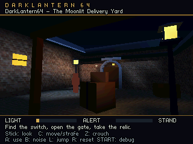
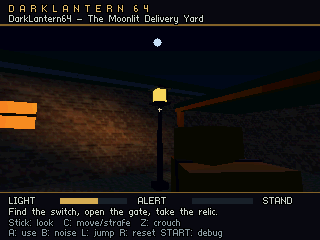

# Nighttime contrast study: the Moonlit Delivery Yard

The [courtyard source](../content/moonlit_courtyard.json) is a separate, fully 3D lighting study. The Lantern Store in `content/first_room.json` remains the original gameplay scene. The new yard connects a covered entrance, open paving, and a sheltered delivery alcove in one continuous space.

The aim is a dark scene with clear shapes, bright local landmarks, and useful hiding places. Night should come from the relationship between these areas, rather than from making every surface equally dim.

## The composition

The walkable footprint is approximately 11 × 15 metres. Real pitched roofs, an open stone arch, modeled street lamps, a guard, angled cargo and six-sided supply drums create silhouettes at different depths. The paving has staggered tessellation for lighting; gameplay positions and collision are not constrained to a tile grid.

Three lighting decisions establish the scene:

- **Cool moonlight defines the open yard.** Its direction has a strong sideways component, so roof slopes, walls and cargo receive different amounts of light. This makes their orientation legible. Roof and shelter collision volumes block the moon, keeping the entrance meaningfully darker than the exposed paving.
- **Warm lamps mark local islands of activity.** Two freestanding lamps illuminate opposite sides of the yard. Their small emissive glass volumes are the brightest warm features; the ironwork remains dark enough to retain its silhouette. A third light sits inside the delivery recess, giving the far doorway a distinct destination.
- **Low ambient light preserves the gaps.** Shadows receive a small cool contribution. Raising that contribution globally would erase the sheltered/exposed difference that the scene is designed to test. Exposure is a separate artistic adjustment, not a substitute for arranging the lights.

The sky is a dark blue gradient, slightly brighter near the roofline. Roof edges can therefore read against the sky without making the roof surfaces bright. Fog starts beyond the main yard; it is available for more distant geometry without veiling nearby lamps and shadows.

Current authored values are tuning coefficients, not calibrated photometric units:

| Setting | Value | Intended effect |
| --- | --- | --- |
| Ambient RGB | 0.012, 0.019, 0.037 | Small cool shadow floor |
| Direction toward moon | −0.76, 0.52, 0.39 | Moon about 31° above the west/south side |
| Moon RGB / intensity | 0.35, 0.52, 0.90 / 0.80 | Cool exposed planes |
| Street lamp RGB / intensity / radius | 1.0, 0.48, 0.12 / 2.2 / 5.0 m | Warm local pools |
| Exposure | 1.35 | Overall display tuning |
| Fog near / far | 18 m / 48 m | Preserve the immediate courtyard |

The lamp geometry has an emissive material. Emission adds surface brightness; the separate point light illuminates surrounding geometry. Bloom and moving specular reflections are future techniques to evaluate.

## Edit, play and capture

Use VS Code's **DarkLantern64: Open courtyard editor**, **Build + Play courtyard**, and **Capture courtyard views** tasks. Save + Cook before building or capturing; those tasks read saved source content. Equivalent commands from the repository root:

```powershell
python tools/build.py --editor --run --level content/moonlit_courtyard.json
python tools/build.py --run --level content/moonlit_courtyard.json
python tools/capture_ares.py --level content/moonlit_courtyard.json
```

The manual ROM is `build/DarkLantern64-moonlit_courtyard.z64`. Generated scene content and reports are under `build/scenes/moonlit_courtyard/`. The courtyard editor has its own layout and command queue; use `python tools/editorctl.py --level content/moonlit_courtyard.json inspect` to address it. The workshop's **Night environment**, light properties and shared material controls save canonical game values. Desktop lighting remains a LightEngine preview; judge final contrast in the game.

The capture task launches a disposable Ares session, freezes simulation at each authored view, and exports the completed RDP framebuffer. PNG locations and ROM hashes are recorded in `build/scenes/moonlit_courtyard/captures.json`. They are raw 320 × 240 images before VI filtering. The pixel dump waits for graphics and writes a large log, so its timings are unsuitable for performance comparisons.

## Repeatable views

The source contains a `views` list for captures and comparisons. Positions are player feet in metres; standing eye height is 1.5 m above them. Yaw 0 faces +Z, yaw 180 faces −Z, and positive pitch looks upward.

| View ID | Feet position | Yaw / pitch | What to judge |
| --- | --- | --- | --- |
| `shelter-to-courtyard` | −2.8, 0, 4.9 | 153° / 5° | The shelter mouth opens onto the yard and distant doorway |
| `warm-lamp-cool-roofs` | 1.0, 0, −1.1 | 298° / 9° | Warm lamp glass separates from cool roof planes, with moon and open sky above |
| `doorway-landmark` | −1.2, 0, −1.8 | 155° / 2° | Bright doorway remains identifiable beyond darker cargo and paving |
| `doorway-open` | −1.2, 0, −1.8 | 155° / 2° | Same camera with the gate open: warm recess and objective become visible |

Compare captures at the same camera and display settings. Evaluate the scene at the actual 320 × 240 game resolution as well as at a larger window. Fine texture detail is less important than keeping the lamp, doorway, walking surfaces and guard silhouette distinct.

A useful next comparison is to change one source setting at a time: disable the moon, disable the near lamp, then raise ambient substantially. The first two reveal each light's contribution; the last should show why excess ambient loses the composition. Keep the final choice based on the game image and measured frame costs.

## Texture assets and geometry budget

Brick and paving base-color images come directly from LightEngine's StreetLight example:

- `examples/assets/textures/brick/brick-color.jpg` → [streetlight-brick.jpg](../content/textures/streetlight-brick.jpg)
- `examples/assets/textures/pavingstone/pavingstone-color.jpg` → [streetlight-pavingstone.jpg](../content/textures/streetlight-pavingstone.jpg)

The original image files are retained as source assets. Brick targets **64 × 32 RGBA16**, preserving its source image's 2:1 aspect ratio; paving targets **32 × 32 RGBA16**. The new OBJ meshes contain UV coordinates. Textured materials use a white tint so the texture's own base color is not darkened twice. Normal, roughness and displacement maps are not used in this study.

The two cooked pixel arrays require **6,144 bytes total** before headers, alignment or container costs. Brick occupies the N64's entire 4 KiB texture memory when uploaded; paving occupies 2 KiB. They are uploaded separately, and brick has no remaining texture-memory room for mipmaps in this recipe. That is separate from total resident RDRAM and from ROM file size; both source JPEGs remain much larger than their game versions. See the [texture pipeline](texture-pipeline.md) for the distinction.

The authored scene has **45 entities, 41 model instances, 26 collision boxes and 1,004 instanced triangles**. Most lighting geometry is spent on the paving and inward-facing warehouse walls. Hidden outer wall faces use coarse triangles. Roofs and the arch use geometry for their profiles; light sources and cargo are solid models rather than camera-facing cards.

All courtyard materials opt into back-face culling with `double_sided: false`. Every source triangle was checked against its expected outward direction: convex components against their centers, the arch against its inner/outer radial directions, and the paving against +Y. This includes the reused guard and objective meshes. Warehouse rotations point the subdivided fronts toward the yard. Lamp caps received explicit downward-facing undersides so they stay visible from below after culling. Positive scale and rotation preserve this winding in the scene. Culling avoids submitting hidden back faces; its actual performance gain belongs in the measured profile.

Roof shadow blockers are upright box approximations at the roofs' bases. They establish covered versus exposed areas; they do not describe the pitched roof's entire shape. Smaller decorative objects do not all have separate shadow proxies. Review visible and gameplay shadow boundaries together before treating them as final stealth rules.

## Captured result and measured cost

The final captures retain dark cargo and shelter silhouettes against lit masonry and blue roof edges. The open-yard view shows the moon above the roofline. Opening the gate reveals the warm recess and relic from the same camera. Lamp intensity was raised locally while ambient and exposure stayed fixed, increasing separation between lit surfaces and hiding places.

Raw N64 framebuffer: sheltered entrance toward the courtyard.



Raw N64 framebuffer: warm street lamp, dark cargo and moon above the roofline.



The [closed gate](images/night-doorway-landmark.png) and [open gate](images/night-doorway-open.png) captures verify the same doorway in both states. All four image files remained byte-identical after the final actor-color reuse and clipping-code optimization.

The final manual ROM was profiled at the spawn camera with the ordinary HUD, moving guard, active audio and no framebuffer dumping. Five complete windows contained 101 frames. These are **emulated CPU-timer elapsed times**, including queue and display waits, from Ares; they are not physical hardware measurements. Full values, source/ROM hashes and image hashes are in [night-study-results.json](night-study-results.json).

| Measurement | Observed value |
| --- | ---: |
| Average frame | 49.95 ms, approximately 20 fps |
| Triangle preparation/submission | 22.27 ms/frame |
| Transforms and frustum codes | 7.79 ms/frame |
| Dynamic lighting | 2.67 ms/frame |
| Gameplay | 4.03 ms/frame |
| Display buffer wait | 10.43 ms/frame |
| HUD / audio callback | 1.55 / 0.62 ms/frame |
| Texture uploads at spawn | 3 per frame |
| Manual ROM | 311,296 bytes |
| Static image: text + data + BSS | 544,704 bytes |
| Peak sampled heap | 668,760 bytes |
| Static night color cache, both gate states | 48,192 bytes, included in heap |
| Resident texture pixels / SDK sprite files | 6,144 / 6,416 bytes |

The initial version averaged 101.67 ms/frame. Back-face culling, skipping unnecessary clipping, simpler box transforms and reusing identical actor probe colors reduced the measured cost. This scene still exceeds the 33.33 ms budget for 30 fps. Geometry submission and transforms are the next performance targets; visibility culling and an RSP geometry path deserve evaluation before adding more scene complexity. These figures describe one camera and short run, not a whole-level worst case or a final memory budget.

Regression testing exposed an RSP asleep with pending commands in the installed SDK/Ares combination. The frame boundary now explicitly flushes the queue before waiting for a display buffer; this wakes queued work without synchronously draining graphics. The reproduced startup failure and original mission replay pass with this change. The smoke helper also reports an RSP crash immediately instead of waiting for its overall timeout. The SDK itself was not modified.

Static corner illumination is prepared for both gate states before play, taking about 1.1 seconds in this Ares run. Opening the gate selects the prepared colors and updates its geometry, avoiding a full-scene relight during interaction. The cache uses the scene's triangle count, not the renderer's maximum capacity. Moving actors receive a small number of runtime light probes. Lights are fixed for this slice; moving lamps or arbitrary combinations of switches need a bounded update strategy. The RDP performs textured rasterization, color interpolation, filtering, depth testing and fog; CPU light queries and geometry preparation remain significant work.

The stealth light meter samples the same occluded sources, independently of display exposure, fog and emissive material brightness. This keeps a brighter presentation from silently changing guard perception. Occlusion still uses coarse authored boxes, and interpolated corner lighting cannot reproduce fine shadow boundaries. Small lightmaps or more selectively placed lighting vertices are possible next quality steps.

Validation includes 61 Python tests, 16 portable simulation groups, strict N64 ROM compilation, live courtyard editor/API checks, four actual framebuffer exports, and the original room's Ares startup/mission checks. Longer courtyard playtesting and original N64/M64 validation remain ahead. The study establishes a workable visual direction and exposes its present costs; final art should keep testing navigation and silhouette readability while refining texture and lighting detail.
