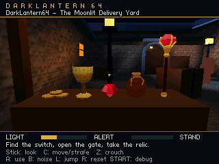

# Project editor and camera verification

Verified September 6, 2026 (Pacific; September 7 UTC). This record covers the project editor workflow and the runtime camera correction. The [creator guide](creator-guide.md) describes everyday use; [developer tools](developer-tools.md) lists the commands for reproducing checks.

## Tested revisions

- Runtime camera correction: DarkLantern64 commit `a208d39`.
- LightEngine: `dc8e3c86a0171795af3a9fe724fc8125925dbba7`, published in [PR #16](https://github.com/hughes/LightEngine/pull/16).
- Final project editor executable SHA-256: `9ca4123ee2668322163c0138d4ef671c49696415388b06bab96b32183b689ff0`.
- Project workflow source is committed alongside this record. Generated build logs and private test projects remain under ignored `build/` and `.dev/` directories.

## Results

| Check | Result |
| --- | --- |
| `python tools/build.py --test` | 141 Python tests ran: 140 passed and one was skipped for Windows symlink privileges; all portable C gameplay, mission, profiling, scale, visibility, shading and launcher checks passed. |
| LightEngine `editor_host_test` | Passed; the integrated project editor also compiled against the pinned engine revision. |
| `python tools/verify_project_editor.py` | All 13 live checks passed in 34.62 seconds using the final executable. Both owned editor sessions exited; real project content hashes remained unchanged. |
| Native editor controls | Verified registered levels in File > Open, level switching, Save and continue, canonical Ctrl+S, and the native window-close unsaved prompt with Cancel preserving edits. |
| Editor **Play level** | Built and booted Moonlit Delivery Yard in Ares at the `loot-counter` test start. |
| Editor **Play game menu** | Built and booted the three-level menu in Ares. |
| `python tools/smoke_ares.py` | Correctly rejected 4 MiB; the 8 MiB mission replay completed without capture. |
| Courtyard N64 captures | All seven authored views completed; the loot counter visibly agrees with the editor's left-to-right arrangement. |
| Enemy verifier fixture cleanup | Isolated checks passed for cleanup after success and failure, exact archived bytes, and preservation of pre-existing source files. |

The 13 project-editor checks cover discovery, distinct previews, creation, first-enemy placement and runtime export, dirty-switch rejection, duplication, title/menu edits, invalid paths and collisions, external-source conflicts, recoverable deletion, active-level fallback, repeated switching, and restoring the last selected level on relaunch.

An earlier private UI session exited before a queued request executed; that request timed out. A fresh owned session subsequently passed both game-launch checks. Existing user editor and emulator instances were left alone.

## Horizontal camera correction

The N64 camera's horizontal basis was reversed relative to the right-handed authoring space. The runtime now computes screen-right consistently with the editor, and turning and strafing use that same convention. Regression checks cover asymmetric authored placement, camera orthogonality across 117 yaw/pitch combinations, and movement at five headings.

This corrected N64 framebuffer capture shows coins, goblet, jewel, purse and scepter from left to right:

Capture SHA-256: `483bc35b6a9cf5ef855db2d2ad3c9174fbf894dbf5df1960013d0ef3afc66017`. This is the raw RDP framebuffer before VI filtering. Capture timings are diagnostic and do not establish gameplay performance.

## Local evidence

| Evidence | Path |
| --- | --- |
| Host checks | `build/project-workflow-host.log` |
| Final editor build | `build/project-editor-build.log` |
| Live project checks | `build/project-editor-verification.json` |
| Actual editor game launches | `build/project-editor-play-results.json` |
| Expansion-memory gate and mission | `build/ares-smoke.json` |
| Camera views | `build/scenes/moonlit_courtyard/captures.json` |

The tested ROM SHA-256 values were:

- Editor Play level: `5a655f03250460fdbee0167a01b2ff73131510435aa1f30c2e1c8fb0dbb11c02`.
- Editor Play game menu: `8bcde2ebe1b0f132d425754894f8abb87376e1e0e39d7830ee2f3e9425ea9438`.
- 8 MiB mission replay: `5a21d170d3358c5425683fff41e1f3c289e7a977c2823e574b0f26434d8c85aa`.
- Courtyard capture: `f913c5a01b9971cec93967d2eb0e2e5851334a50e4cc21026eae8f41da2036eb`.

Original N64 and M64 hardware validation remains pending. These results describe the tested source and binaries; rerun relevant checks after later changes.
