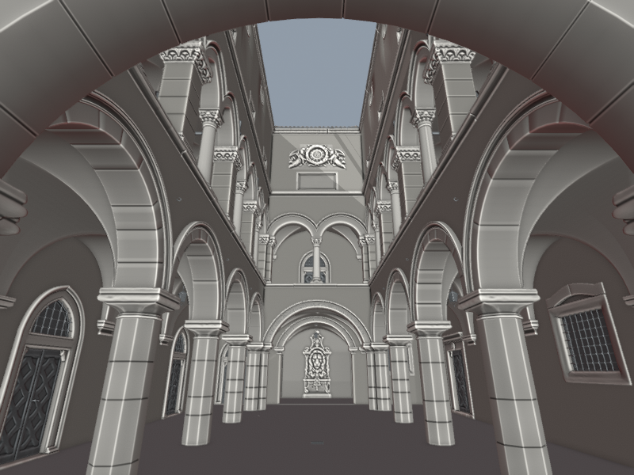
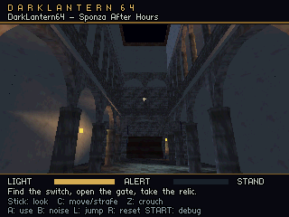
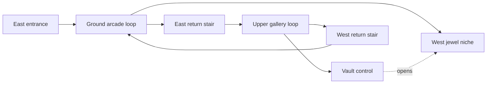
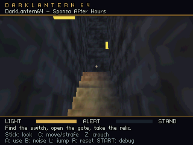
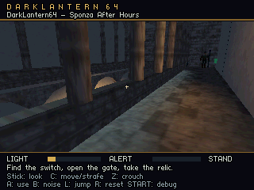

# Sponza After Hours

This level rebuilds the recognizable spaces of Intel's New Sponza reference as
an N64-sized stealth environment: a narrow open courtyard, a lower arcade, a
continuous upper gallery, and the tall walls and roof around the sky opening.
It is an interpretation of the supplied scene, rather than a decimation of its
3.75 million triangles. Columns, arch openings, gallery slabs and roof shapes
receive geometry; stone courses, carved trim, brick and roof tiles use small
textures derived from the supplied materials.



The reference above is a desktop clay view. Below is the rebuilt scene's actual
320×240 N64 framebuffer in Ares, before VI filtering.



Open **Sponza After Hours** in the editor's **Levels** panel and use **Play level**.
It is also included in the ordinary **Launch game** menu. The **Start preset**
selector provides courtyard, upper-gallery, stair and unlocked-vault starts.
No additional VS Code task is required. A direct command is:

```powershell
python tools/build.py --level content/sponza_courtyard.json --run
```

## Two floors in one world

Both storeys inhabit the same XYZ level. The upper walking surface is 5.30 m
above the courtyard. Slabs support actors above and block movement and sight
below; the central void remains open between floors. There is no floor switch,
teleport, loading transition, or grid-aligned world representation.

The source has no usable stairs. This version adds two enclosed return
stairways beyond opposite ends of the galleries. Each climbs 5.30 m using
22 risers of about 24.1 cm, split into two flights with a landing. The treads
are 30 cm deep and each flight is one metre wide. Both fit the current 28 cm
step-up limit. Floors and ceilings have separate simple collision proxies;
visual detail does not increase the number of collision faces.



One guard patrols each loop. The routes have explicit Y coordinates, so the
upper patrol stays upstairs. The same runtime movement can climb these stairs
when a patrol route passes through their landings. Guards do not yet discover
stair routes when chasing a player on another floor: they need a navigation
graph or navmesh with connected walkable surfaces. Authored patrols prove
movement; they do not substitute for that future route planner.

## Atmosphere and the small encounter

Cool moonlight reveals the pale courtyard architecture. Warm lamps mark the
entrance, a lower arcade, the upper gallery, both stair landings and the vault,
with dark stretches between them for cover. The upper control opens the west niche downstairs,
making the vertical route part of the encounter. Its jewel is the collectible
objective. Coins in the opposite upper gallery suggest a second search detour;
they are decorative in the current single-objective prototype.

The art uses real arch apertures and continuous column models. Upper capitals
and roof profiles are simplified, and the source's dense ornamental carving
is represented by texture. Original PBR maps, 4K images, alpha foliage and
fine displacement are not carried into the ROM.

Lighting exposed two practical modeling requirements. The tall courtyard needs
a steep moon angle for direct light to reach its floor. Stair treads and large
wall panels need interior vertices where a lamp's pool should appear; lighting
only at corners beside blocking walls loses that pool. Visible wall surfaces
must also sit on the room-facing side of their collision boxes, so lighting
probes do not begin inside the wall. These are deliberate mesh/proxy choices,
without a change to the runtime lighting rules.




## Assets and editing

- [Canonical level](../content/sponza_courtyard.json): normal editor-owned
  entities, lights, patrols, interactions and test starts.
- [Shared Sponza pack](../content/assets/sponza/pack.json): mesh/material
  definitions. Guards and loot link their existing shared packs.
- [Blender source](../art/sponza.blend): the editable low-poly architectural
  scene. It is separate from the guard's Blender file.
- [Saved-mesh exporter](../tools/export_sponza.py): brings saved Blender mesh,
  UV and normal edits into the existing OBJ assets.
- [Geometry generator](../tools/sponza_geometry.py): the initial architecture
  and explicit collision boxes, including the stair routes.
- [Texture recipes](../content/assets/sponza/textures.json): source hashes,
  crops, resizing, colors, tile borders and attribution notes.
- [Level assembler](../tools/sponza_level.py): recreates the initial authored
  scene from those manifests. Running it replaces the canonical level; commit
  designer edits before choosing to regenerate.

For mesh edits, open `art/sponza.blend`, edit geometry in Edit Mode, return to
Object Mode and save. Then run:

```powershell
python tools/export_sponza.py --check
python tools/export_sponza.py
```

Use **Save + Cook** in the editor to refresh the preview and game. The check
validates all saved levels against the candidate geometry; publication replaces
only this pack's owned OBJ files and rolls back on failure. Editing linked mesh
data updates every instance sharing that asset. The real Blender check verified
a 1 cm column edit through all ten placements.

Keep object names, origins/transforms, linked mesh data and material assignments
intact. Place instances and change collision in the level editor. Apply modifiers
before saving; this geometry-only path excludes shape keys, new assets, material
changes and collision regeneration. Enlarging a visible column does not resize
its collision proxy. The geometry generator recreates its initial meshes and
will overwrite later exported artist edits.

Collision-only static entities are listed in **Room Objects**. Their position,
yaw and scale affect support, blocking and sight without requiring a rendered
mesh. Visual models and collision proxies are separate entities in this level;
moving a stair or floor requires updating both. Collider `surface` metadata is
not yet connected to material-specific footstep audio.

Eight Sponza tiles occupy **22 KiB decoded**, using three 64×32 images and five
32×32 images in RGBA16. The guard and loot atlases bring total unique decoded
pixels to 26 KiB. Sprite headers, geometry, audio and renderer buffers are
additional memory. Every individual texture fits the RDP's 4 KiB texture
memory; they are uploaded as materials change.

## Verification and remaining scale work

| Current content | Quantity |
| --- | ---: |
| Placed model vertices | 5,898 / 6,144 |
| Placed triangles | 3,902 / 4,096 |
| Model instances | 114 / 128 |
| Collision boxes | 118 |
| Animated guards | 2 |
| Local lights | 8 |
| Unique decoded textures, including guards/loot | 26 KiB |

The scenery itself uses 3,240 vertices and 2,496 triangles. The table includes
guards, loot, control, door, lamps and the plinth. There are 246 vertex slots
left in the current allocation, insufficient for another 1,009-vertex guard.

The actual portable `game.c` movement code passes 36 stair traversals: both
stairs, both directions, standing and crouching players and guards, at 60, 30
and 10 simulation updates per second. Across 16,618 sampled positions including
the objective route there
were no penetrations or falls below the supporting surface. The checks also
cover floor/ceiling clearance and sight through the open atrium versus sight
blocked by the gallery slab. See [physics evidence](evidence/sponza-physics.json).

The entire objective route also passes through ordinary crouched movement,
turning and interaction inputs with both authored guards and all lights active:
entrance, east stair, upper control, west stair, and jewel. The host simulation
completes it in about 85.8 seconds without teleporting the player or disabling
guard perception. This is a gameplay correctness check, not a speedrun or an
N64 frame-rate measurement.

The [editor/Blender checks](evidence/sponza-geometry-verification.json) verify
saved mesh transforms, both floors, shared animation preview and a collision
proxy's edit/save/reopen path in an isolated editor. The [export proof](evidence/sponza-export-verification.json)
checks real saved-Blender edits through the ordinary compiler. The [eight game
captures](evidence/sponza-captures.json) cover the arcades, gallery, both stairs,
control and jewel.

The first ordinary Ares stress measurement exposed a CPU bottleneck. Over
30 seconds, the courtyard delivered 18.22 fresh frames/s (54.87 ms average CPU
work), while the upper gallery delivered 57.24 (15.37 ms). Both guards remained
active, audio and gameplay ran normally, and neither sample ended in a caught
or complete state. The courtyard submitted roughly 2,507–3,042 triangles per
frame versus 1,030–1,565 upstairs. These are different views and workloads,
not a claim that adding a floor has a fixed performance cost. The baseline is
preserved for the targeted collision/query and immutable-transform fixes.

Those two fixes improve the same scene without changing its geometry or textures.
The final recheck also includes the subsequent lighting-load optimization:

| Authored view | Before: fresh frames/s | After: fresh frames/s | After: average / maximum CPU work |
| --- | ---: | ---: | ---: |
| Courtyard | 18.22 | **41.15** | 24.28 / 32.355 ms |
| Upper gallery | 57.24 | **59.83** | 12.25 / 18.869 ms |

The courtyard presented 1,245 fresh frames over 1,810 native refreshes; the
gallery presented 1,802 over 1,802. The gallery still had 15 CPU work samples
above 16.667 ms, so sustained presentation does not imply spare CPU time on
every frame. The courtyard remains above the 60 fps work budget. These are
stationary authored views with moving guards, normal audio and active gameplay
in Ares, not original-hardware measurements or worst-case combat guarantees.
See the [before](evidence/sponza-performance-before.json) and
[after](evidence/sponza-performance.json) reports for exact inputs and timings.

Ray-box tests now reject clearly separated segments before divisions, preserve
grazing/endpoint cases for the original interval test, and avoid repeated libm
min/max calls. Vertical movement skips horizontal checks when no floor or
ceiling crossing is possible. Together these reduced courtyard gameplay CPU
time from 27.18 to 5.49 ms. Static scenery also retains its pose and world
matrix, saving 666 trigonometric calls each frame; camera transforms and moving
entities still update normally. That cache occupies 11.5 KiB.

The optimized single-level ROM reports 772,304 bytes of static image and a
sampled peak heap allocation of 1,474,808 bytes. These are separate quantities;
the game bundle has a larger resident asset set, and sampled heap use is not a
proof of every transient peak. No new scene vertex/triangle allocation was
introduced to achieve the speedup.

Static night lighting now runs during content cooking. A separate
[loading study](level-loading.md) reduces Sponza renderer preparation from
3.70 seconds to 0.43 seconds, retaining exact static colors for both door
states. Its 51,292-byte ROM bake streams into the existing lighting cache.
Geometry, materials and lights still use the normal Save + Cook workflow.

Scenery is split into bays and tiers so existing per-model frustum rejection
can discard geometry outside the view. There is no portal/PVS renderer yet.
The open atrium deliberately exposes both storeys at once; a portal system
would not eliminate genuinely visible opposite galleries. Enclosed stairs and
side spaces are better candidates for future 3D cells and portal visibility.
Collision/light queries still scan box lists. Spatial query acceleration and
cross-floor navigation are the next architectural work exposed by this scene.

For larger interiors, cells should be 3D volumes, including vertically stacked
rooms and the stair volume joining them. Navigation links need entry/exit
positions and traversal clearance; visibility portals need actual openings.
An acoustic graph can reuse the room connections while assigning its own
transmission and muffling costs. A single XZ tile or floor-number lookup cannot
represent a player under a balcony and a guard above it correctly.

Visible distant guards currently use their complete meshes and full pose
sampling. Distance-based geometry and animation detail are useful next steps.
This scene is close to the current **software** vertex/triangle limits; the
16-enemy schema limit does not imply space for sixteen copies of this guard.
Raising cache capacities needs a memory and frame-time measurement, and adding
a cheaper far-guard mesh would spend less of both budgets.

## Reference and credit

Reference: the user-supplied `NewSponza_Main_glTF_003.gltf` in LightEngine's
`examples/assets/external/sponza`, SHA-256
`e04c4c540c74bdddcbd3f590a85c14119bfd5839702246a23b3a737c0cce2400`.
The local reference contains about 3.75 million triangles and 72 referenced
4K PNGs; its original files are not copied into this repository.

Intel distributes Sponza through its [graphics research samples](https://www.intel.com/content/www/us/en/developer/topic-technology/graphics-research/samples.html).
The [overview](https://www.intel.com/content/www/us/en/developer/topic-technology/graphics-research/overview.html)
and samples page have used different license descriptions. The supplied folder
has no adjacent license/version manifest, so the precise download's terms and
individual artist attribution are not established here. The texture manifest
preserves that uncertainty and the exact source hashes; the architecture is
newly modeled, and the small textures are derivatives of the supplied images.
