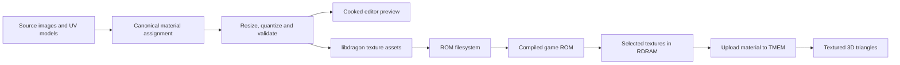

# Textures from LightEngine to the N64

Status: **first working slice, 2026-09-05.** The Moonlit Delivery Yard cooks the StreetLight brick and paving images into the ROM and renders them on fully 3D UV-mapped models. Canonical materials persist source references and target dimensions; the GUI edits existing texture dimensions, color and emission. New source assignment currently uses JSON or the editing API. The preview uses the same quantized PNG pixels sent to libdragon's texture converter; Ares captures verify the actual N64 output.

## What makes the StreetLight example work

The inspected reference is LightEngine's [StreetLight scene](https://github.com/hughes/LightEngine/blob/a6be6a0926032ebc5f02ae845ff2548e93fa43a2/examples/assets/levels/StreetLight.json) and its [rendered screenshot](https://github.com/hughes/LightEngine/blob/a6be6a0926032ebc5f02ae845ff2548e93fa43a2/docs/screenshots/tess-shadows-streetlight.png), linked at the project's tested engine revision.

The source files `content/textures/streetlight-brick.jpg` and `streetlight-pavingstone.jpg` are byte-for-byte copies of LightEngine's [brick color image](https://github.com/hughes/LightEngine/blob/a6be6a0926032ebc5f02ae845ff2548e93fa43a2/examples/assets/textures/brick/brick-color.jpg) and [pavingstone color image](https://github.com/hughes/LightEngine/blob/a6be6a0926032ebc5f02ae845ff2548e93fa43a2/examples/assets/textures/pavingstone/pavingstone-color.jpg). Their upstream creator and license were not documented in that checkout; this records their immediate provenance without asserting an upstream license.

Its brick color image is **1024 × 512** pixels; pavingstone, concrete and metal color images are **1024 × 1024**. Materials also reference normal, roughness, metalness or displacement maps. Brick and pavingstone use nonzero displacement settings. Warm spotlights cast shadows against cool directional fill; one spotlight projects a gel texture.

The strongest transferable features are the brick and paving patterns, curb and pole silhouettes, warm light pools, deep shadows, and color contrast. Small textures and deliberate lighting can preserve much of that composition. Moving highlights from roughness/normal maps, fine displaced surfaces and soft dynamic shadows need different techniques. A downsized PBR material does not automatically produce an equivalent N64 material, and we should judge closeness in a playable scene rather than promise a percentage.

## Working authoring and build flow



Canonical materials store source references, target dimensions and pixel format. UV coordinates and repeat scale come from the OBJ. Source images stay in `content/textures/`; generated files belong under `build/`. **Save + Cook** validates references and UV seams, quantizes the images and refreshes the preview. **Build ROM** runs the SDK converter and packages the resulting assets. The desktop preview helps author materials; it does not simulate N64 lighting or rasterization.

To assign a new image, save and close its workshop, add the source file under `content/textures/`, and edit the material's `texture.uri` in the level JSON. Assign that material ID to the model entity's `material` field, validate, then reopen the workshop. The **Material** panel shows the source URI read-only and edits target dimensions. Automation can also assign through `set_material`; a GUI image picker is future work. For example, add this material and reference it from a model with OBJ `vt` coordinates on every face:

```json
{
  "id": "brick-wall",
  "color": [1, 1, 1, 1],
  "texture": {
    "uri": "textures/streetlight-brick.jpg",
    "width": 64,
    "height": 32,
    "format": "RGBA16"
  }
}
```

The initial format is **RGBA16 only**, with power-of-two dimensions up to 64 and a 4 KiB per-texture limit. The cooker BOX-resizes, quantizes to RGB555 plus one alpha bit, and emits a PNG for the editor and converter. OBJ UV seams survive mesh export; image V orientation is converted once and shared by preview and runtime. The game uses perspective-correct texture coordinates, wrapping, bilinear filtering, Gouraud color modulation and hardware depth testing. Its clipping interpolates UV and color alongside position.

The installed SDK already provides `mksprite` for PNG conversion, palette quantization, dithering, mipmaps and compression, plus `mkdfs` for the ROM filesystem. The JPEG sources therefore need an offline resize/PNG conversion step. Despite its name, libdragon's `.sprite` container also holds textures for 3D models. At runtime, `sprite_load` loads an asset into memory and `rdpq_sprite_upload` prepares it for textured triangles, including its palette. [Image assets](https://libdragon.dev/ref/sprite_8h.html), [texture upload](https://libdragon.dev/ref/rdpq__sprite_8h.html).

The cooker records source/recipe/PNG/sprite hashes, converter identity, actual sprite bytes, decoded pixel bytes and TMEM fit. Invalid assets fail cooking before publication. Source-image, recipe or converter changes invalidate the relevant asset and ROM cache. The courtyard reports live under `build/scenes/moonlit_courtyard/generated/`: `texture_report.json` describes cooked pixels; `texture_runtime_report.json` records actual SDK output. Pixels are loaded once per scene; this first slice has no texture streaming.

## Three different memory costs

The N64's **4 KiB TMEM is the working texture store used for drawing**, not the entire game's texture allowance. Assets live in ROM, selected assets occupy shared RDRAM, and draw batches upload them into TMEM. Indexed formats reserve TMEM's upper 2 KiB for palette lookup. A 16-color palette only needs 32 bytes of RGBA16 entries in the asset, but that does not release the reserved TMEM half. [TMEM and palettes](https://libdragon.dev/ref/rdpq__tex_8c.html).

Calculated examples below exclude headers, alignment, mipmaps and allocator overhead. Actual compressed ROM sizes must be measured; no compression ratio is assumed.

| Format example | Uncompressed pixels + palette in ROM/RAM | TMEM allocation needed |
| --- | ---: | ---: |
| Brick, 64 × 32 CI4, 16 colors | 1,024 + 32 bytes | 1,024 bytes + 2,048 reserved |
| Pavingstone, 64 × 64 CI4, 16 colors | 2,048 + 32 bytes | Entire 4,096 bytes; no mipmap room |
| General texture, 32 × 32 RGBA16 | 2,048 bytes | 2,048 bytes |
| Courtyard brick, 64 × 32 RGBA16 | 4,096 bytes | 4,096 bytes |

The CI4 rows are future candidates; palette support and quality still need implementation and review. The courtyard uses **6,144 pixel bytes** across brick and paving. The two uncompressed SDK sprite files total **6,416 bytes**, including their headers; filesystem and allocator overhead are additional. The brick and paving occupy TMEM successively, not simultaneously. All resident assets compete with audio and other systems within our 8 MiB RDRAM baseline. Reusing a material reuses its resident texture; each upload still costs bandwidth. Runtime logs include a per-frame upload count.

## Fidelity steps

The [night contrast study](night-contrast.md) combines the working texture path with occluded colored moon/point lights, emissive lamp glass and distant fog. Use the workshop's **Material** controls to persist game material changes; stock LightEngine Material Library edits still affect only the desktop preview.

The next improvements are:

- Bake stable crevice shading and ambient occlusion into compact textures. Keep switchable illumination separate so extinguished lamps do not leave painted light pools.
- Move static vertex-light preparation offline or add small lightmaps. Currently the game prepares static corner colors for both gate states at startup; moving actors use a bounded number of runtime probes. Freely moving or switchable lamps need an explicit update policy before adding them.
- Spend geometry on silhouettes and large surface changes; represent small masonry relief through texture shading.
- Evaluate mipmaps, detail textures and dynamic shadow approximations against measured cost. Emission currently adds surface brightness; it does not automatically create a light source or bloom.

Use the [profiler](profiling.md) to compare texture uploads, geometry submission and frame waits. Validate clipping, UV seams and material changes in Ares, then confirm performance on N64/M64 hardware before expanding the asset budget.
