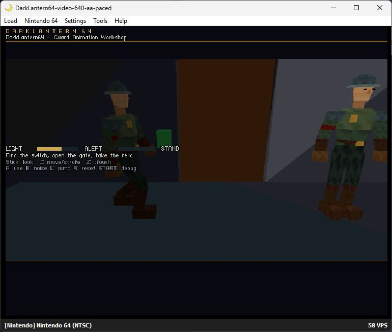

# Resolution and antialiasing study

The [verified two-guard renderer](guard-renderer-performance.md) provides a useful starting point for higher image quality. Its 11.55 ms average CPU work does not measure unused RDP time: geometry, rasterization, CPU work and video scanout overlap. Resolution and antialiasing must therefore be measured on the actual scene.

The Ares experiments support **320 × 240 at 60 fps with hardware AA**, and **640 × 480 at 30 fps with hardware AA and deliberate interlaced presentation pacing**. These are measured workshop diagnostics; the default game remains 320 × 240 without AA.

The [measurement record](evidence/video-quality-study.json) freezes commit `6264ca3`, before the shared-resource migration and subsequent sleeve/depth work. Its hashes identify the exact baseline; these results are not a performance certification of later revisions.

| Measured mode | Presentation over roughly 30 seconds | Average / maximum CPU work |
| --- | --- | ---: |
| 320 × 240, no AA (default baseline) | 1,800 fresh images / 1,800 scans; no repeats | 11.553 / 16.276 ms |
| 320 × 240, standard AA | 1,800 fresh images / 1,800 scans; no repeats | 11.534 / 16.664 ms |
| 640 × 480i, standard AA, paced | 901 complete images / 1,802 fields; no incomplete images | 12.740 / 17.068 ms |

The progressive modes measured 59.8262 images/s; paced 480i measured 29.9701 complete images/s at a 59.9401 Hz field rate. Both AA runs had zero CPU work samples exceeding their respective 16.667/33.333 ms budgets. The 320 AA worst sample is very close to its budget, so it does not establish spare capacity for more guards or heavier gameplay. Small average differences between runs are not evidence that AA speeds up the CPU.

An unpaced 640 × 480 trial rendered a new source every video field but replaced every source before its other row parity appeared. Merely pacing render starts to 30 Hz also left incomplete images because graphics completion varied. The successful version queues only RDP-completed surfaces and publishes one on a fixed alternating VI callback phase, before libdragon selects its next scanout buffer. It needs no Tiny3D or SDK patch. Waiting remains recorded in `display_wait` and in total elapsed frame samples.

## Hardware and memory tradeoffs

At the same field of view, 640 × 480 makes the world viewport shade four times as many pixels as 320 × 240. Vertex and triangle counts remain unchanged, while framebuffer/depth traffic and fill work increase. A nominal 30 fps target allows twice the elapsed time per game frame, not four times the memory bandwidth.

| Output dimensions | Color buffer | Three colors + one depth buffer | Increase over current |
| --- | ---: | ---: | ---: |
| 320 × 240 | 150 KiB | 600 KiB / 0.586 MiB | — |
| 640 × 240 | 300 KiB | 1,200 KiB / 1.172 MiB | 600 KiB |
| 640 × 480 | 600 KiB | 2,400 KiB / 2.344 MiB | 1,800 KiB |

These are calculated payload sizes at 16 bits per color/depth pixel. They exclude allocator alignment, textures, command buffers, geometry, audio and other game memory. Three display buffers permit CPU/graphics overlap; changing that count would be a separate performance/latency tradeoff.

The SDK's 640 × 480 preset is **interlaced**; 640 × 240 is progressive. A 480i video field contains alternating rows. Counting every change of the raw scanout address as a fresh image is invalid because the SDK also changes the row offset between fields. It can switch to another ready framebuffer on either field. Stable 30 fps output needs deliberate field pacing as well as enough rendering throughput. [Display modes](https://libdragon.dev/ref/display_8h.html), [inspected display callback](https://github.com/hughes/libdragon/blob/7a82f8e50e82ad4601d530801630d8bd0d2fcd00/src/display.c#L64)

N64 antialiasing uses RDP coverage and the VI reconstruction filter. It does not require allocating a separate multisample color framebuffer. The experiment enables `AA_STANDARD` for geometry and `FILTERS_RESAMPLE_ANTIALIAS` at display initialization. Gamma and dithering remain unchanged. This is still additional graphics work, and its appearance must be judged after VI filtering; the existing raw RDP framebuffer exports cannot establish final edge quality. [Antialiasing API](https://libdragon.dev/ref/rdpq__mode_8h.html)

## Diagnostic method

`tools/video_study.py` snapshots a passed ordinary workshop build, its sources, object files, Tiny3D library and texture filesystem. It recompiles three staged translation units and records their changes, compiler flags and hashes. It does not change the default game, SDK, source level, guards, animations or textures.

The 640 modes double the world viewport dimensions and focal length, retaining the same field of view and geometry workload. **HUD text/layout remains unscaled in these diagnostic builds.** They are not finished launch options for content creators.



This separate post-VI capture shows the AA mode's output. It is not a controlled image-quality comparison or part of the timed run.

The staged VI observer registers the three actual framebuffer addresses. It maps both field offsets back to their source buffer and counts buffer changes, buffers observed with both row parities, and sources replaced before both parities appeared. Unknown addresses invalidate the measurement. A source-buffer change rate alone is not a coherent 480-line frame rate. The portable helper tests cover held buffers, progressive frames, interlaced pairs and unknown/ambiguous addresses.

Three initial reporting windows are excluded. Normal guard AI, audio, lighting and HUD remain active; the debug overlay is off. Measurements use Ares's emulated clock and VI behavior, not the host monitor rate or original N64/M64 hardware. The optional two-field pacing mode verifies coherent interlaced presentation; a production mode still needs a scaled UI and broader scene/hardware validation.

```powershell
python tools/verify_guard_performance.py --visibility-report docs/evidence/guard-60fps-visibility.json --output build/guard-60fps/final-verification.json
python tools/video_study.py 320-aa --run
python tools/video_study.py 640-none --run --windows 30
python tools/video_study.py 640-aa --run --windows 30
python tools/video_study.py 640-aa --field-pacing 2 --run --windows 30
```

The default baseline is `build/guard-60fps/final-verification.json`, produced by the first command above. Diagnostic outputs remain under `build/video-study/`. No additional VS Code tasks are needed.
